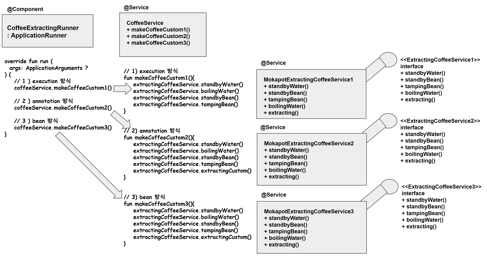
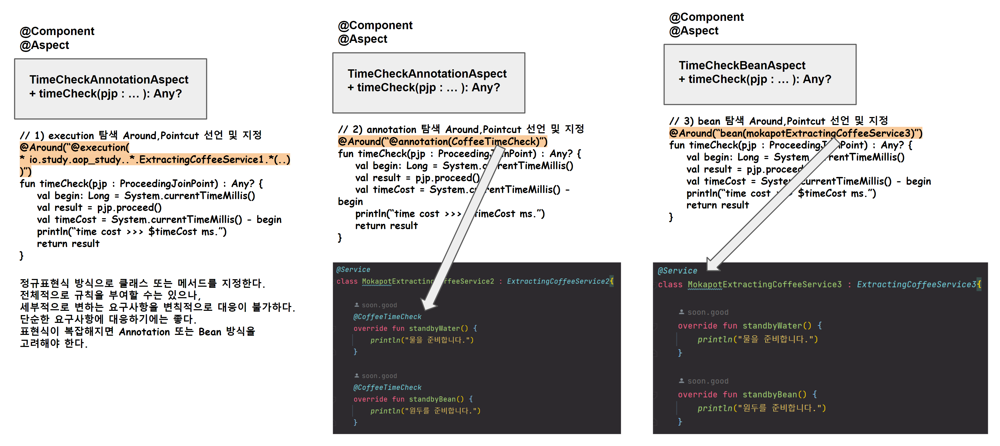
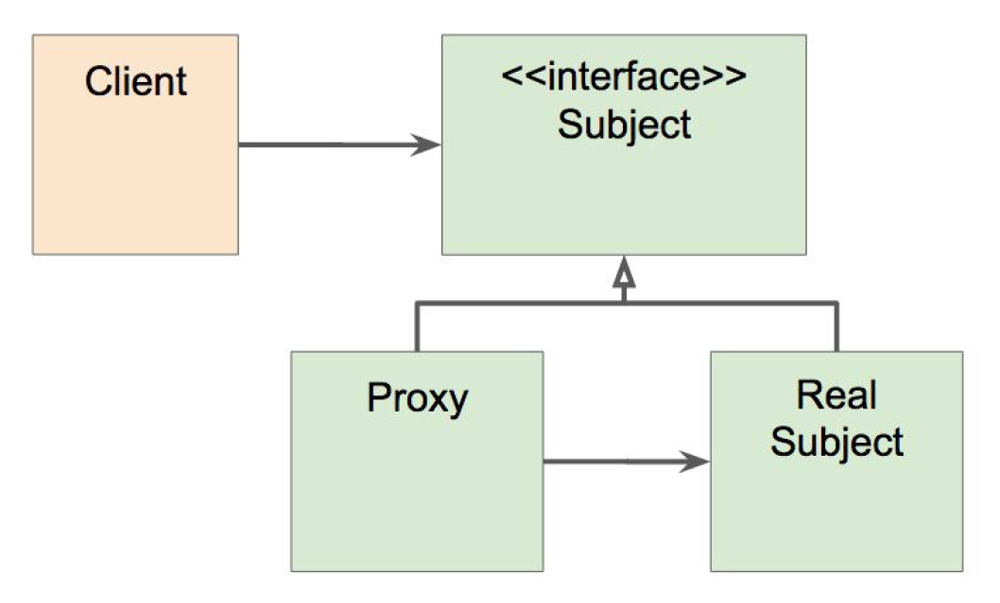
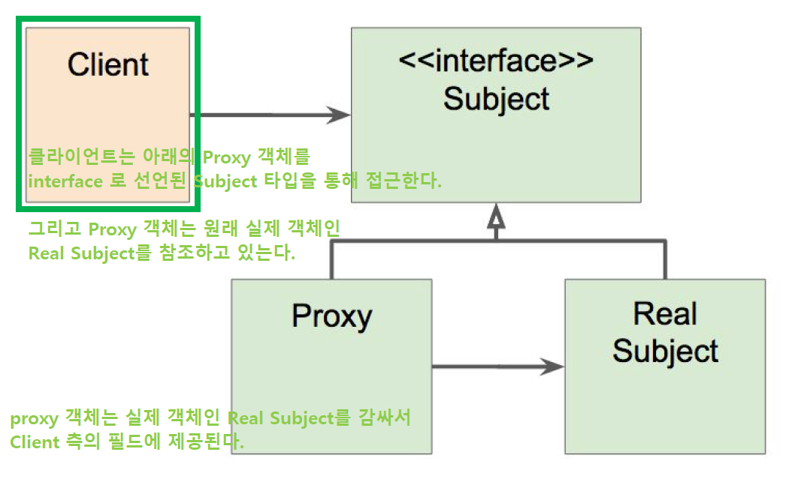

### AOP 용어 요약

#### @Aspect

흩어진 관심사들을 모듈화 한 것을 의미한다.

@Around, @Before, @After 등과 같은 어드바이스가 적용된 메서드 들을 모아두기 위해 정의한 클래스를 의미한다.

```kotlin
// 어노테이션 방식 역시 @Component 로 선언되어야 하고 @Aspect 로 선언되어야한다.
@Component
@Aspect
class TimeCheckAnnotationAspect {

    @Around("@annotation(CoffeeTimeCheck)")
    fun timeCheck(pjp : ProceedingJoinPoint): Any? {
        // ...
    }
}
```

<br>


#### Target

Aspect 를 적용할 대상 (클래스, 메서드)

<br>


#### "할일", Advice (e.g. @Around, @Before, @After, ... )

- e.g. `@Around` , `@Before`, `@After`

<br>


스프링 AOP 에서는 어드바이스의 종류가 여러가지다. 그 중 대표적인 것들만 추려보면 아래와 같다.

- @Around
- @Before
- @After


<br>


아래 Aspect 의 의미는 <u>"`@CoffeeTimeCheck` 어노테이션이 붙은 모든 메서드의 시작/끝에 아래 정의한 timeCheck(pjp) 메서드를 실행하겠다."</u>  는 의미다.

```kotlin
// 어노테이션 방식 역시 @Component 로 선언되어야 하고 @Aspect 로 선언되어야한다.
@Component
@Aspect
class TimeCheckAnnotationAspect {

    @Around("@annotation(CoffeeTimeCheck)")
    fun timeCheck(pjp : ProceedingJoinPoint): Any? {
        val begin: Long = System.currentTimeMillis()

        // ProceedingJoinPoint 를 통해 Aspect 가 감싸고 있는 구현체의 로직을 대신 실행한다.
        val result = pjp.proceed()

        val timeCost = System.currentTimeMillis() - begin
        println("time cost >>> $timeCost ms.")

        return result
    }
}
```

<br>


#### "어디서" PointCut (e.g. execution(...), @annotation(...), bean(...) )

- e.g. `execution(...)`, `@annotation(...)`, `bean(...)`

<br>


스프링 AOP 라이브러리에서는 포인트 컷(`PointCut`)은 어드바이스(`Advice`) 내에 정의하도록 구성되어있다.

포인트 컷은 어드바이스의 호출지점을 의미한다.

즉, `Advice` 를 어디서 실행할지 정의하는 것이 `PointCut` 이다.

특정 정규표현식으로 지정한 곳에서 사용할지, 어노테이션을 사용할지 등을 명시하는 역할을 한다.

스프링 AOP 에서는 포인트 컷의 종류가 여러가지다. 그 중 대표적인 것들만 추려보면 아래와 같다.

<br>


- execution
  - e.g. `@Around("execution(* io.study.aop_study..*.ExtractingCoffeeService1.*(..))")`
- annotation
  - e.g. `@Around("@annotation(CoffeeTimeCheck)")`
- bean
  - e.g. `@Around("bean(mokapotExtractingCoffeeService3)")`


<br>


#### "언제", JoinPoint

- e.g. `ProceedingJoinPoint`

@Advice 를 언제 수행할 지를 정의하는 객체다. 

스프링 AOP 라이브러리에서는 어드바이스(`Advice`)가 적용된 메서드 내의 파라미터로 `ProceedingJoinPoint` 객체를 주입받아서 사용한다.

```kotlin
@Component
@Aspect
class TimeCheckBeanAspect {

    @Around("bean(mokapotExtractingCoffeeService3)")
    fun timeCheck(pjp : ProceedingJoinPoint): Any? {
        val begin: Long = System.currentTimeMillis()

        // ProceedingJoinPoint 를 통해 Aspect 가 감싸고 있는 구현체의 로직을 대신 실행한다.
        val result = pjp.proceed()

        val timeCost = System.currentTimeMillis() - begin
        println("time cost >>> $timeCost ms.")

        return result
    }

    @Before("bean(mokapotExtractingCoffeeService3)")
    fun printNewLine(){
        println("  ")
    }
}
```

<br>


- timeCheck(pjp : ProceedingJoinPoint){...} 메서드에는 `@Around` 어드바이스가 적용되어 있다.
- 메서드의 파라미터인 `pjp: ProceedingJoinPoint` 는 스프링 AOP가 주입시켜주는 객체다.


<br>


### 참고)  Java 에서의 AOP, 스프링에서의 AOP

Java 에서는 `AspectJ`, `스프링 AOP` 가 대표적으로 존재한다. AspectJ와 스프링 AOP 는 조금 다르다.

<br>

AspectJ

- AOP에 비해서 굉장히 많은 기능과 다양한 JointPoint, PointCut 을 제공한다.

스프링 AOP

- 약간은 국한된 기능만을 제공한다.


### 예제로 살펴보는 Spring AOP

#### 의존성 추가

스프링 AOP를 적용하기 위해서는 아래와 같은 의존성을 추가해줘야 한다.

```groovy
implementation("org.springframework.boot:spring-boot-starter-aop")
```

<br>


#### 3 가지 방식의 Spring AOP

AOP를 적용하는 방식은 대표적으로 아래의 3가지 방식들이 있다. 

- 1 ) execution 방식 Aspect 선언
- 2 ) annotation 방식 Aspect 선언
- 3 ) bean 방식 Aspect 선언

<br>


#### 예제 수행 시나리오

**전체적인 호출 흐름**<br>

위에서 정리한 execution 방식, annotation방식, bean 방식의 AOP 모두를 예제로 작성해본 코드의 단순한 구조는 아래와 같다.



<br>

**@Aspect 적용 메서드들**<br>

- makeCoffeeCustom1()
- makeCoffeeCustom2()
- makeCoffeeCustom3()


각각의 Aspect 는 아래와 같이 선언되어 있다.



<br>


#### **CoffeeExtractingRunner** : ApplicationRunner

- 먼저 aop가 적용된 각각의 메서드인 makeCoffeeCustom1(), makeCoffeeCustome2(), makeCoffeeCustom3() 는 CoffeeExtractingRunner 클래스의 run 메서드에서 실행한다.

<br>

makeCoffeeCustom1(), makeCoffeeCustom2(), makeCoffeeCustom3() 각각은 CoffeeExtractingRunner 내에서 아래와 같이 호출한다.

```kotlin
@Component
class CoffeeExtractingRunner(
    val coffeeService: CoffeeService
) : ApplicationRunner{

    override fun run(args: ApplicationArguments?) {
        // 1) execution 방식 (@Aspect 내에 정규표현식 검색 방식의 @Around 적용 메서드를 정의해둠)
//        coffeeService.makeCoffeeCustom1()

        // 2) annotation 방식 (@Aspect 내에 어노테이션 검색 방식으로 @Around 적용 메서드를 정의해둠)
//        coffeeService.makeCoffeeCustom2()

        // 3) bean 방식 (@Aspect 내에 Bean 검색 방식으로 @Around 적용 메서드를 정의해둠)
        coffeeService.makeCoffeeCustom3()

        // 3) 내부호출로 인해 extractingNormal 하나에 대해서만 timeCheck 메서드가 호출된다.
//         coffeeService.makeCoffeeNormal()

    }

}
```

<br>


#### CoffeeService

CoffeeService 는 여러 가지 종류의 extractingCoffeeService 개별 인스턴스들을 기반으로 호출하는 용도의 서비스다. 각각의 개별 인스턴스들의 이름은 `mokapotExtractingCoffeeService1`, `mokapotExtractingCoffeeService2`, `mokapotExtractingCoffeeService3` 이다.

<br>

간단한 코드는 아래와 같다.

```kotlin
@Service
class CoffeeService (
    @Qualifier("mokapotExtractingCoffeeService1") val extractingCoffeeService1: ExtractingCoffeeService1,
    @Qualifier("mokapotExtractingCoffeeService2") val extractingCoffeeService2: ExtractingCoffeeService2,
    @Qualifier("mokapotExtractingCoffeeService3") val extractingCoffeeService3: MokapotExtractingCoffeeService3
){

    // 조금 더 시간을 절약하기 위해 물을 준비하고 끓이는 동안 원두를 준비한다.
    fun makeCoffeeCustom1(){
        extractingCoffeeService1.standbyWater()
        extractingCoffeeService1.boilingWater()
        extractingCoffeeService1.standbyBean()
        extractingCoffeeService1.tampingBean()
    }

    fun makeCoffeeCustom2(){
        extractingCoffeeService2.standbyWater()
        extractingCoffeeService2.boilingWater()
        extractingCoffeeService2.standbyBean()
        extractingCoffeeService2.tampingBean()
        extractingCoffeeService2.extractingCustom()
    }

    fun makeCoffeeCustom3(){
        extractingCoffeeService3.standbyWater()
        extractingCoffeeService3.boilingWater()
        extractingCoffeeService3.standbyBean()
        extractingCoffeeService3.tampingBean()
        extractingCoffeeService3.extractingCustom()
    }

    // 프록시 객체여도 내부 호출은 프록시적용이 안된다는 것을 예제로 보이기 위해...
    fun makeCoffeeNormal(){
        extractingCoffeeService1.extractingNormal()
    }
}
```

<br>


#### ExtractingCoffeeService1,2,3, MokapotExtractingService1,2,3

##### ExtractingCoffeeService1,2,3

ExtractingCoffeeService1,2,3 각각은 interface 다. 그리고 내부 정의는 모두 클래스/파일 명만 다를 뿐 아래와 같이 정의되어 있다.

```kotlin
// ...

interface ExtractingCoffeeService1 {

    fun standbyWater()

    fun standbyBean()

    fun tampingBean()

    fun boilingWater()

    fun extractingNormal()

    fun extractingCustom()
}
```

<br>


##### MokapotExtractingService1,2,3

MokapotExtractingService1,2,3 각각은 ExtractingCoffeeService1,2,3 을 implements 하고 있는데 그 중 MokapotExtractingService1 의 정의는 아래와 같다.

```kotlin
// ...

@Service
class MokapotExtractingCoffeeService1 : ExtractingCoffeeService1{
    override fun standbyWater() {
        println("물을 준비합니다.")
    }

    override fun standbyBean() {
        println("원두를 준비합니다.")
    }

    override fun tampingBean() {
        println("템핑을 합니다.")
    }

    override fun boilingWater() {
        println("물을 끓여요.")
    }

    override fun extractingNormal() {
        standbyWater()
        standbyBean()
        tampingBean()
        boilingWater()

        println("모카포트 추출 시작!!! 치~치~ 소리가 나면 불을 끄면 됩니다.")
    }

    override fun extractingCustom() {
        println("모카포트 추출 시작!!! 치~치~ 소리가 나면 불을 끄면 됩니다.")
    }

}
```

<br>


#### Aspect 정의

Aspect 는 아래의 3 종류의 Aspect 들 각각을 개별 정의했다.

- 1 ) execution 방식 Aspect 선언
- 2 ) annotation 방식 Aspect 선언
- 3 ) bean 방식 Aspect 선언

<br>

스프링 AOP를 적용하기 위해서는 Aspect 로 사용될 클래스는 모두 빈(Bean) 으로 선언되어 있어야 한다.<br>

<br>


##### 1\) execution 방식의 Aspect

이 Aspect 의 의미는 <u>"`io.study.aop_study` 패키지 아래의 모든 클래스 들 주에서 ExtractingCoffeeService 안에 있는 모든 메서드의 시작/끝에 아래 정의한 timeCheck(pjp) 메서드를 실행하겠다."</u>  는 의미다. 스프링 AOP가 적용되기 위해서는 빈(Bean)으로 선언되어 있어야 하기에 `@Component` 로 선언해두었다.<br>

```kotlin
@Component
@Aspect
class TimeCheckExecutionAspect(
){
  
  // ...
  
  @Around("execution(* io.study.aop_study..*.ExtractingCoffeeService1.*(..))")
  fun timeCheck(pjp : ProceedingJoinPoint): Any? {
    val begin: Long = System.currentTimeMillis()

    // ProceedingJoinPoint 를 통해 Aspect 가 감싸고 있는 구현체의 로직을 대신 실행한다.
    val result = pjp.proceed()

    val timeCost = System.currentTimeMillis() - begin
    println("time cost >>> $timeCost ms.")

    return result
  }
}
```

<br>


###### @Around 란?

```kotlin
@Around("execution(* io.study.aop_study..*.ExtractingCoffeeService1.*(..))")
```

"Around 어드바이스를 사용하겠다." 는 의미.

execution 이라는 것은 포인트 컷을 의미한다. 

어디에 적용하겠다를 명시한다.

<br>


##### 2\) annotation 방식의 Aspect

이 Aspect 의 의미는 <u>"`@CoffeeTimeCheck` 어노테이션이 붙은 모든 메서드의 시작/끝에 아래 정의한 timeCheck(pjp) 메서드를 실행하겠다."</u>  는 의미다.

```kotlin
// 어노테이션 방식 역시 @Component 로 선언되어야 하고 @Aspect 로 선언되어야한다.
@Component
@Aspect
class TimeCheckAnnotationAspect {

    @Around("@annotation(CoffeeTimeCheck)")
    fun timeCheck(pjp : ProceedingJoinPoint): Any? {
        val begin: Long = System.currentTimeMillis()

        // ProceedingJoinPoint 를 통해 Aspect 가 감싸고 있는 구현체의 로직을 대신 실행한다.
        val result = pjp.proceed()

        val timeCost = System.currentTimeMillis() - begin
        println("time cost >>> $timeCost ms.")

        return result
    }
}
```

<br>


###### @Around 란?

```kotlin
@Around("@annotation(CoffeeTimeCheck)")
```

"Around 어드바이스를 사용하겠다." 는 의미.

annotation 이라는 것은 포인트 컷을 의미한다. 

어디에 적용하겠다를 명시한다.

<br>


##### 3\) bean 방식의 Aspect

이 Aspect 의 의미는 <u>"`mokapotExtractingCoffeeService3` 라는 이름의 빈(Bean) 내의 모든 메서드의 시작/끝에 아래 정의한 timeCheck(pjp) 메서드를 실행하겠다."</u>  는 의미다.

```kotlin
// ...

@Component
@Aspect
class TimeCheckBeanAspect {

    @Around("bean(mokapotExtractingCoffeeService3)")
    fun timeCheck(pjp : ProceedingJoinPoint): Any? {
        val begin: Long = System.currentTimeMillis()

        // ProceedingJoinPoint 를 통해 Aspect 가 감싸고 있는 구현체의 로직을 대신 실행한다.
        val result = pjp.proceed()

        val timeCost = System.currentTimeMillis() - begin
        println("time cost >>> $timeCost ms.")

        return result
    }

    @Before("bean(mokapotExtractingCoffeeService3)")
    fun printNewLine(){
        println("  ")
    }
}
```

<br>


###### @Around 란?

```kotlin
@Around("bean(mokapotExtractingCoffeeService3)")
```

"Around 어드바이스를 사용하겠다." 는 의미.

bean 이라는 것은 포인트 컷을 의미한다. 

어디에 적용하겠다를 명시한다.

<br>


### AOP의 적용 레벨 (컴파일/로드타임/런타임)

AOP 는 컴파일,로드타임,런타임 레벨에 각각 적용가능하다.<br>


#### 컴파일 타임 레벨에서의 AOP

컴파일 시점에 적용된다.<br>


장점

- 컴파일 시점에 한다면, 런타임/로드 타임 때에 실행하는 것에 비해 성능적인 부하가 다소 적다. 
- 바이트 코드로 만들 때에 만들어진 상태이기 때문

단점

- 컴파일 시점에 AOP가 되려면, 별도의 컴파일 과정을 한번 더 거쳐야 한다는 단점이 있다.

<br>


#### 로드 타임 레벨에서의 AOP

A 라는 클래스가 컴파일 된 것을 로딩하는 시점에 적용한다.<br>

로딩하는 시점에 로딩하는 클래스 정보를 변경하는 방법이 있다.<br>

이것을 `로드 타임 위빙` 이라고 부른다.<br>

> "로드 타임에 위빙(끼워넣는)한다."

<br>


단점

- 로드 타임에 클래스를 읽어들이는 약간의 부하가 생길 수 있다는 단점이 있다.
- 로드타임 위버 자바 에이전트를 설정해줘야 한다는 단점이 있다.
- 약간의 성능부하 존재

<br>


#### 런타임 레벨에서의 AOP

스프링이 사용하는 방식이다.<br>

A 라는 클래스 또는 빈에 Aspect를 적용해야 한다는 것을 스프링이 인지하고 있는다.<br>

그래서 A라는 클래스 타입의 빈을 만들 때, A라는 타입의 프록시를 만든다.<br>

즉, A 라는 타입을 감싼 프록시 빈을 만든다.<br>

이 프록시 빈이 실제 A가 가지고 있는 foo()라는 메서드를 호출하기 전에 `hello` 를 먼저 찍는 일을 하고, 그 다음에 A를 호출한다.<br>

<br>


단점

- 빈 생성 초기에 성능 부하가 생길 수 있다는 점은 단점이다.
- 하지만, 빈 생생 초기에만 부하가 생기는 것이기에 실제 요청이 발생할 때 부하가 생기지는 않는다.
- 로드타임위버나 컴파일 시에 별도의 컴파일 과정을 거치는 등의 별도의 과정이 필요하게 되지는 않는다.
- 문법이 굉장히 쉽고, 별도의 AOP 공부를 많이 할 필요도 없다.

<br>


### 프록시 패턴이란

빈의 스코프를 설명할 때 프록시를 설명하는 경우가 많다. 하지만 그것은 완벽한 프록시 패턴을 의미하는 것이 아니다.

원래 프록시 패턴은 interface가 있다. 

클라이언트는 interface 를 타입으로 접근해서 프록시 객체를 접근한다.



<br>


클라이언트는 Proxy 객체를 interface로 선언된 `Subject` 타입을 통해 접근한다.

`Proxy` 객체는 원래 실제 객체인 `Real Subject` 를 참조하고 있는다.

`Proxy` 객체는 실제 객체인 `Real Subject` 를 감싸서 Client 측의 필드에 제공된다.

<br>



<br>


