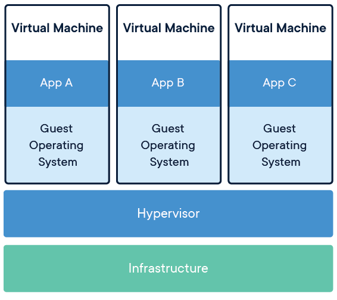
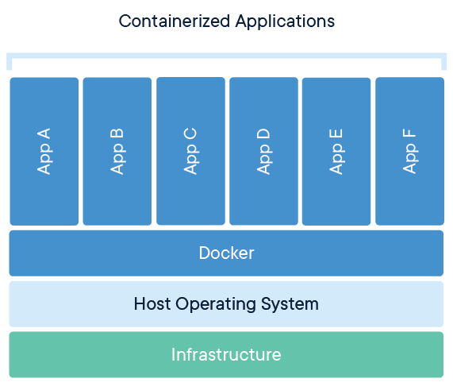
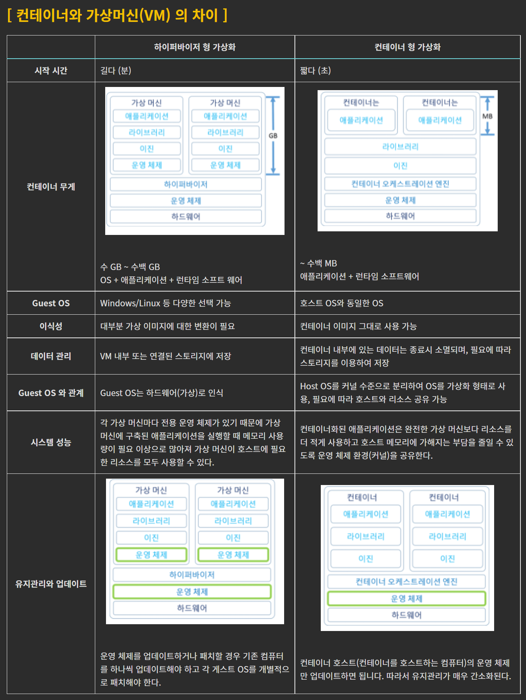

### Docker, k8s

### vm 이란? (vm 은 hyperviser 위에서 동작한다.)

EC2, GCP, GCE 등의 형태로 제공된다.

 

각 Virtual Machine 은 위의 그림에서 보듯 **Hypervisor** 위에서 동작한다. 중요한 점은 **각 VM 마다 독립된 실행환경을 제공한다**는 점이다. **데이터, 코드 모두 공유하지 않는다.**

이렇게 **각 VM마다 독립된 실행환경을 가지기 때문에 각 VM마다 최소로 필요한 공간이 GB 단위로 필요**하다. 이로 인해 **퍼포먼스 오버헤드도 꽤 크다**.

 

#### 반가상화(para-virtualization), 전가상화(full-virtualization)

가상머신의 가상화 기술이 오버헤드가 크기 때문에 반가상화 라는 기술 역시 도입되었다.

참고 : [https://born-dev.tistory.com/39](https://born-dev.tistory.com/39) 

 

가상화에는 하드웨어까지 가상화하는 전가상화(full virtualization),반가상화(para-virtualization)가 있다.

- 전 가상화(full virtualization)
  - 단점으로는 속도가 느리다는 단점이 있다.
- 반 가상화(para virtualization)
  - 현재는 반가상화형식으로 퍼포먼스를 제공하고 있지만, 이것 역시 리얼머신에 비해 느리다.

반가상화는 예를 들면 아래와 같이 Xen 과 같은 반가상화 방식으로 구성된다.

 

### 컨테이너란 ? (컨테이너는 Docker 엔진 위에서 동작한다.)

> 참고
>
> - https://www.44bits.io/ko/keyword/linux-container
> - https://www.redhat.com/ko/topics/containers/whats-a-linux-container

 

- 가상화 방식은 느리고 무겁다.

- 컨테이너는 리눅스의 프로세스 격리 기능을 의미한다.
- 컨테이너는 리눅스 커널을 공유하면서 프로세스를 격리된 환경에서 실행한다.
- 우리에게 잘 알려진 Docker 엔진 또는 Kubernetes 엔진은 컨테이너를 실행시키는 것이 가능하다.

 

 

#### 장점) OS의 자원들을 컨테이너 간 공유

docker 의 컨테이너는 독립된 실행 환경을 제공하지 않는다. 따라서 OS 의 많은 자원들을 컨테이너간 공유한다. 

#### 장점) 자원을 공유하므로, 부팅속도가 빠르다.

이렇게 자원을 공유하기 때문에 부팅 시에 자원을 생성할 필요가 없으니 부팅속도 역시 가상머신 방식에 비해 빠르다. 

#### 장점) 자원을 공유하므로, 디스크 공간 역시 많이 차지하지 않는다.

OS의 자원을 공유하기에 독립된 자원들을 컨테이너 내에서 독자적으로 생성하지 않는다. 따라서 디스크 공간 역시 많이 차지하지 않는다. 

#### 장점)  컨테이너는 OS의 자원을 독점하는 것으로 인식한다.

컨에이너가 자원을 독립된 실행환경으로 제공하는 것이 아니라 공유하더라도, 컨테이너 내부의 프로세스들은 이를 감지하지 못하고, 자신이 OS의 모든 자원을 독점하고 있는 것으로 간주한다. 

 

### 컨테이너와 VM 의 차이점

https://born-dev.tistory.com/39 

컨테이너와 VM의 차이점을 비교할 때 두드러지는 차이점은 확장방식과 이식성이다. 

 

**컨테이너**

컨테이너는 가상머신에 비해 그 크기도 가볍다. MB 단위의 크기를 갖는다. 컨테이너 내에서 마이크로 서비스가 동작하도록 패키징하게끔 구성해서 배포되는 경우가 많다. 

컨테이너는 경량화 속성을 가지고, 공유 운영체제를 가지는 속성 덕에 다른 OS 환경이라도, 컨테이너를 구동시켜주는 엔진이 존재한다면, OS나 운영환경이 다르더라도 매우 쉽게 이동이 가능하다. 

 

**가상머신**

가상머신은 가상머신 자체가 OS의 역할을 하기 때문에 GB 단위의 크기를 갖는다. OS의 역할을 대신할 수 있기 때문에 리소스를 전적으로 필요로 하는 기능들을 수행할 수 있다. 

가상머신은 서버, OS, 데스크탑, 데이터베이스, 네트워크를 추상화할수도 있고, 분할,복제, 애뮬레이션할 수 있다. 

 

### 컨테이너의 장점

https://born-dev.tistory.com/39

1. 가볍다.
2. 탄력적이다.
3. 밀도
4. 성능
5. 유지관리 효율

 

**가볍다. 디스크, RAM 등의 호스트 리소스를 적게 사용**

- 가상머신의 경우 RAM 자원 역시 호스트에서 가져와야 하므로 자원을 필요한 만큼 독점한다. 
  - 반면, 컨테이너는 RAM 을 공유해서 사용하고, 도커엔진이나 쿠버네티스 엔진이 RAM의 분배를 관리해주기 때문에 리소스를 가볍게 사용한다.
- 가상머신의 경우 OS 에 필요한 하드디스크를 고정적으로 차지해야하고 기본적으로 GB이상의 디스크를 차지하게 된다. 개별적인 애플리케이션을 모두 가상머신으로 구성할 경우 비용을 감당하기 쉽지 않다.

 

**탄력성**

- 가상머신에 비해 탄력적이다. 
- 상황에 따라 리소스를 동적으로 확장하거나 축소할 수 있다.

 

**밀도**

물리적 서버 한대에서 동시에 실행할 수 있는 개체 수를 밀도라고 한다. 컨테이너는 도커엔진 또는 쿠버네티스 엔진이 컨테이너를 관리하기 때문에 물리적 서버 한 대에서 동시에 실행할 수 있는 개체수가 많아진다. 이것이 가능한 이유는 도커엔진, 쿠버네티스 엔진이 호스트의 리소스들을 효율적으로 각각의 컨테이너에게 효율적으로 스케쥴링해서 분배하기 때문이다.

 

### 컨테이너의 단점

[https://born-dev.tistory.com/39]() 

보안 이슈가 있다. 컨테이너는 커널을 공유한다. 논리적으로 격리한 것이 컨테이너이기에, 물리적으로 격리된 환경이 아니다. 따라서 보안이 취약할 수 있다는 단점이 존재한다. 

 

### 컨테이너를 사용하는 경우

개별 애플리케이션을 컨테이너로 배포해서 확장과 축소를 트래픽에 따라 효율적으로 늘리고 축소해야 할 경우에 유용하다.

여러 종류의 마이크로 서비스를 배포하고자 할 때 개별 마이크로 서비스는 컨테이너 단위로 배포하는 것이 합리적이다.

 

### 가상머신을 사용하는 경우

컨테이너 만으로는 호스트OS없이 동작하기 쉽지 않다. 따라서 하드웨어 기반의 서버를 구동하거나 클라우드 서비스에서 제공하는 가상머신이 필요한데 어느 정도의 필요한 하드웨어 리소스를 확보하고자 할 때 가상머신을 선택한다. 

 

### 컨테이너 vs 가상머신 선택 기준

[https://born-dev.tistory.com/39](https://born-dev.tistory.com/39) 

 

컨테이너

- 클라우드 네이티브 애플리케이션 빌드
- 마이크로서비스 패키징
- DevOps, CI/CD 프랙티스 촉진
- 동일한 OS를 공유하는 다양한 IT 설치 공간에서 확장 가능한 IT 프로젝트 전환

가상머신

- 레거시, 모놀리딕 워크로드 수용
- 위험한 개발 사이클 분리
- 인프라 리소스 프로비저닝

 

### 컨테이너, 가상머신 차이점 표

[https://born-dev.tistory.com/39](https://born-dev.tistory.com/39)

 

