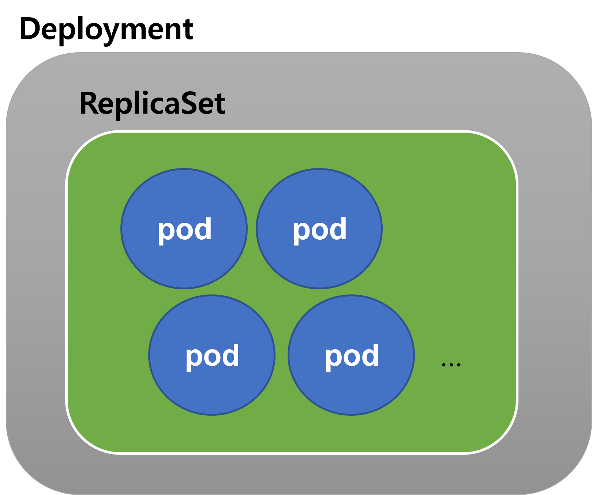

### Infra. EKS, k8s, 인그레스, 서비스, 컨피그맵, 디플로이먼트, 레플리카셋, Pod

### Table Of Contents

- 디플로이먼트, 레플리카셋, Pod
- 인그레스, 인그레스 컨트롤러
- 서비스
- 컨피그맵

### 디플로이먼트, 레플리카셋, Pod

Deployment 는 배포를 위한 하나의 단위다. 

ReplicaSet 은 pod 을 여러 개로 복제를 하기 위한 하나의 단위다.

pod 은 running 중인 컨테이너 하나를 관리하는 쿠버네티스의 개체를 의미한다. 도커 이미지가 컨테이너로 구동될때 하나의 컨테이너들에 대한 단위를 쿠버네티스 엔진에서는 pod 이라는 개념으로 인식해서 관리한다. 

 

디플로이먼트는 쉽게 설명하면 아래와 같은 그림이다. 

 

### 서비스(Service) 란?

Pod 의 논리적 집합을 의미하며, Pod 을 외부에 어떻게 노출시키고 어떻게 접근할지에 대한 정책을 정의해둔다.

Pod 의 IP는 계속해서 변하기도 하고 클러스터 내에서만 인식되는 내부 IP다. 따라서 이것을 외부로 노출시켜야 한다. 

이렇게 Pod 을 외보로 노출시키는 타입들은 아래의 4종류가 있다. 

- Cluster IP (default) : 클러스터 내부에서만 접근 가능한 IP
- NodePort : Port 번호를 통해 외부에서 접근 (NAT 컨셉)
- Load Balancer : 외부의 Load Balancer 를 사용하는 방법
- ExternalName : kube-dns 컴포넌트로 DNS를 이용하는 방법

 

### 인그레스, 인그레스 컨트롤러란?

인그레스(Ingress)

- 클러스터 외부에서 유입되는 네트워크 요청들을 어떻게 처리할지 정의해둔 규칙
- 트래픽 로드밸런싱, TLS/SSL 인증서 처리, 도메인 기반 가상 호스팅, 외부접근 URL 처리등과 같은 규칙들을 정의해둔 자원

 

인그레스 컨트롤러(Ingress Controller)

- 인그레스를 실제로 동작시키는 것

 

**ingress** 는 **'설정'** 이라는 개념이고, 사실은 **Ingress Controller** 가 실제로 **'인그레스를 동작시키는 주체'**다. ingress-nginx 는 쿠버네티스에서 공식으로 제공하는 오픈소스 인그레스 컨트롤러다. 

- ingress-gce
  - 구글 컴퓨팅 엔징 용도의 인그레스 컨트롤러
  - ingress-gce 는 GCE를 이용하면 자동으로 사용할 수 있다. (kubernetes를 개발한 곳이 구글)
- ingress-nginx
  - nginx 용도의 ingress-nginx
  - 쿠버네티스에서 공식으로 제공하는 오픈소스 인그레스 컨트롤러
- AWS Load Balancer <u>Controller</u>
  - 참고
    - [ingress 로 서비스 외부 노출시키기(AWS LoadBalancer Controller 설치)](https://three-beans.tistory.com/entry/AWSEKS-%EC%BD%98%EC%86%94%EB%A1%9C-%EC%83%9D%EC%84%B1%ED%95%98%EB%8A%94-EKS-%E2%91%A3-ingress-AWS-LoadBalancer-Controller-%EA%B5%AC%EC%84%B1)

  - EKS 환경에서는 ingress controller 로 AWS LoadBalancer Controller 를 사용하면 Ingress 생성시 ALB 구성을 지원하게 된다.

 

#### 클라우드 서비스에서의 인그레스, 일반환경에서의 인그레서

클라우드 서비스를 사용하면 별다른 설정 없이 자체 로드밸런서 서비스와 연동해서 인그레스 서비스를 사용할수 있다. 

**ingress-nginx** 

클라우드 서비스가 아닌 직접 구축해야 하는 인프라의 경우 인그레스 컨트롤러를 직접 인그레스와 연동해야 한다. 쿠버네티스 공식 깃헙 리포지터리인 [github.com/kubernetes/ingress-nginx](https://github.com/kubernetes/ingress-nginx) 에서 제공하는 ingress-nginx 가 가장 많이 사용되는 오픈소스 인그레스 컨트롤러다. ingress-nginx 컨트롤러는 인그레스에 설정한 내용을 nginx 환경 설정으로 변경해서 nginx 에 적용한다. 

**ingress-nginx 컨트롤러 외의 ingress 컨트롤러들** 

nginx 기반인 ingress-nginx 컨트롤러 외에도 HAProxy, Envoy, Kong 등 소프트웨어 프록시 인그레스 컨트롤러도 있고, Citrix, F5 등 로드밸런서 장비 회사에서 장비에 대해 적용할 수 있도록 되어있는 인그레스 컨트롤러도 있다. 

 

### 컨피그맵

컨피그맵 (ConfigMap)이란 설정 파일을 네임스페이스에 저장하는 오브젝트다. 파드는 컨피그맵을 디스크처럼 마운트할 수 있다. 예를 들면, 미들웨어의 설정 파일을 컨피그 맵으로 저장하면 파드가 네임스페이스에서 읽어들일 수 있다. 

- https://kubernetes.io/docs/tasks/configure-pod-container/configure-pod-configmap

 

