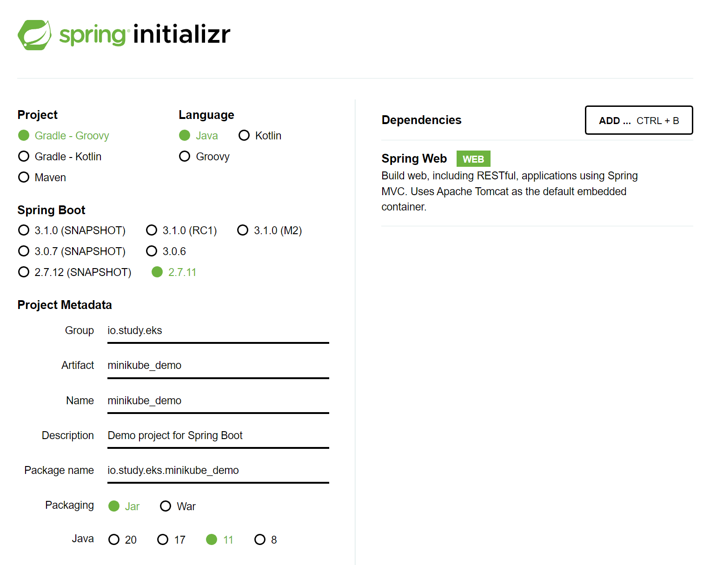
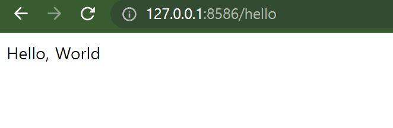

### Infra. K8S. Minikube 기반 Spring Boot Helloworld

### 프로젝트 생성

Web 만 추가함.



<br>


### Controller

별다른 설정은 하지 않고, 아래의 코드를 입력<br>

단순하게 /hello 라는 API 를 접근하면, "HelloWorld" 라는 문자열을 리턴하는 REST API다.<br>

```java
@RestController
public class HelloController {
    @GetMapping("/hello")
    public String getHello(){
        return "Hello, World";
    }
}

```

<br>


위 API 를 eks 클러스터에 안착시키고 외부에 노출시키는 게 이번 예제의 목적이다.

<br>


### CORS 설정

그냥 테스트 용도의 앱이기에 아래의 CORS 관련 임시 설정 코드를 지정해주자. 메인 애플리케이션 클래스에서 WebMvcConfigurer 관련 인스턴스를 인라인으로 생성해서 빈으로 등록했다. 

```java
@SpringBootApplication
public class MinikubeDemoApplication {

	@Bean
	public WebMvcConfigurer corsConfigurer(){
		return new WebMvcConfigurer() {
			@Override
			public void addCorsMappings(CorsRegistry registry) {
				registry.addMapping("/**")
						.allowedMethods("*")
						.allowedOrigins("*");
			}
		};
	}

	public static void main(String[] args) {
		SpringApplication.run(MinikubeDemoApplication.class, args);
	}

}

```

<br>


### 버전명 수정

이건 해도 되고 안해도 되는건데, 버전명을 짧게 해서 예제를 간단하게 보이기 위해 build.gradle 의 버전 명을 수정했다.

```groovy
// ...

group = 'io.study.eks'
version = '0.0.1'
sourceCompatibility = '11'

// ...
```

<br>


### Dockerfile 작성 및 이미지 빌드

```dockerfile
FROM openjdk:17-alpine AS jar-image
WORKDIR deploy
COPY build/libs/minikube_demo-0.0.1.jar app.jar
RUN java -jar -Djarmode=layertools app.jar extract

FROM openjdk:17-alpine
WORKDIR deploy
COPY --from=jar-image deploy/dependencies/ ./
COPY --from=jar-image deploy/snapshot-dependencies/ ./
COPY --from=jar-image deploy/spring-boot-loader/ ./
COPY --from=jar-image deploy/application/ ./

ENTRYPOINT ["java", "org.springframework.boot.loader.JarLauncher"]
```

<br>


dockerfile 을 build 한다.

build 전에 jar 파일이 있어야 하기 때문에 gradlew bootJar 로 jar 파일을 만들어준 후 dockerfile 을 build 한다. tag 이름은 0.0.1 로 지정해줬다.

이미지 명에는 `_` (언더바) 대신 `-` 로 대체해줬다. kubernetes 매니페스트 파일에서는 `_` 가 인식되지 않고 alphanumeric 한 값들만 지정해줄수 있기 때문이다.

```bash
$ ./gradlew bootJar
$ docker build --tag soongoood/minikube-demo:0.0.1 .

# MS Window 이 개발환경이어서 findstr 을 사용 
# (linux/mac 의 경우 grep 을 사용)
$ docker image ls | findstr soongoood/minikube-demo 
soongoood/minikube-demo		0.0.1	44e5e10149c1   22 minutes ago   343MB
```

<br>


### Docker 저장소에 푸시

ECR 을 쓸지 docker hub 를 쓸지 고민을 많이 했다. 얼마 전에 AWS에서 한것도 없는데 AWS 비용이 65$ 가 나와서 충격을 먹어서... 이번에는 docker hub 를 사용해보기로 했다.. ㅠㅠ

<br>

#### docker hub 에 리포지터리 생성

minikube_demo 라는 이름으로 리포지터리를 생성했고 도커허브 리포지터리는 [여기](https://hub.docker.com/repository/docker/soongoood/minikube_demo/general)다.

<br>


#### 참고) ECR

ECR 에 푸시하는 법은 ECR 리포지터리 대시보드에서 [푸시 명령 보기] 버튼을 클릭하면 계정 명에 맞게 명령어가 생성되고 복사해서 붙여넣기를 반복해서 하다보면 된다.

<br>


#### 이미지 푸시

```bash
docker push soongoood/minikube-demo:0.0.1
```

<br>


### deployment 작성 및 구동

#### deployment 란?

deployment 의 개념은 쉽게 설명하면 이렇다.


<br>


Deployment 는 배포를 위한 하나의 단위다.

ReplicaSet 은 pod 을 여러 개로 복제를 하기 위한 하나의 단위다.

pod 은 running 중인 컨테이너 하나를 관리하는 쿠버네티스의 개체를 의미한다. 도커 이미지가 컨테이너로 구동될때 하나의 컨테이너들에 대한 단위를 쿠버네티스 엔진에서는 pod 이라는 개념으로 인식해서 관리한다..

<br>


#### deployment.yml 작성

deployment 라는 개념을 쿠버네티스에서 구동시키려면 쿠버네티스 엔진에게 하드웨어를 어떻게 쓸거다 하는 주문서를 제출해야 한다. 이 주문서 같은 개념은 쿠버네티스에서는 매니페스트 파일이라는 이름으로 불린다. 앞으로는 계속해서 매니페스트 파일이라는 이름으로 부를 예정이다.<br>

일단 아래와 같이 deployment.yml 파일을 작성하자.<br>

<br>


**deployment.yml**<br>

```yaml
apiVersion: apps/v1
kind: Deployment
metadata:
  name: minikube-demo-k8sapp
  labels:
    app: minikube-demo-k8sapp
spec:
  replicas: 1
  selector:
    matchLabels:
      app: minikube-demo-k8sapp
  template:
    metadata:
      labels:
        app: minikube-demo-k8sapp
    spec:
      containers:
        - name: minikube-demo
          image: soongoood/minikube-demo:0.0.1
          ports:
            - containerPort: 8080
```

<br>


#### deployment 배포

쿠버네티스에는 아래와 같이 배포하자.

```bash
$ kubectl apply -f deployment.yml
deployment.apps/minikube-demo-k8sapp created

$ kubectl get deployments
NAME                   READY   UP-TO-DATE   AVAILABLE   AGE
minikube-demo-k8sapp   1/1     1            1           13m
```

<br>


### Service 작성

minikube-demo 라는 웹 앱은 현재 replicaset 안의 pod 에서는 8080 이라는 port에 자기 자신을 노출하고 있다. 그런데 이 웹 앱을 레플리카 셋에서 공통적으로 통신할 수 있는 포트로 노출시켜야 하는데, 이번 예제에서는 NodePort 를 이용해서 노출시킨다.

NodePort 의 30080 포트로 사용자가 접근하면, NodePort 는 ReplicaSet 안의 각각의 Pod 들의 포트인 8080 로 연결해준다. 아씨.. .설명 어렵네 ㅋㅋ

그림을 그려서 나중에 추가할 예정.

<br>


#### service.yml 작성

```yaml
apiVersion: v1
kind: Service
metadata:
  name: minikube-demo-k8sapp
  namespace: default
  labels:
    app: minikube-demo-k8sapp
spec:
  selector:
    app: minikube-demo-k8sapp
  ports:
    - protocol: TCP
      port: 8080
      nodePort: 30080
  type: NodePort
```

<br>


#### service 배포

```bash
$ kubectl apply -f service.yml
service/minikube-demo-k8sapp created
```

<br>


### minikube 에 service 배포

```bash
$ minikube service minikube-demo-k8sapp


|-----------|----------------------|-------------|---------------------------|
| NAMESPACE |         NAME         | TARGET PORT |            URL            |
|-----------|----------------------|-------------|---------------------------|
| default   | minikube-demo-k8sapp |        8080 | http://192.168.49.2:30080 |
|-----------|----------------------|-------------|---------------------------|
🏃  minikube-demo-k8sapp 서비스의 터널을 시작하는 중
|-----------|----------------------|-------------|-----------------------|
| NAMESPACE |         NAME         | TARGET PORT |          URL          |
|-----------|----------------------|-------------|-----------------------|
| default   | minikube-demo-k8sapp |             | http://127.0.0.1:8586 |
|-----------|----------------------|-------------|-----------------------|
🎉  Opening service default/minikube-demo-k8sapp in default browser...
❗  Because you are using a Docker driver on windows, the terminal needs to be open to run it.
```

<br>


위에서 알려주는대로 http://127.0.0.1:8586 에 접속하면 아래와 같은 화면이 나타난다.




<br>


### 배포용도 yml 작성

**minikube-demo-k8sapp.yml**

```yaml
apiVersion: apps/v1
kind: Deployment
metadata:
  name: minikube-demo-k8sapp
  labels:
    app: minikube-demo-k8sapp
spec:
  replicas: 1
  selector:
    matchLabels:
      app: minikube-demo-k8sapp
  template:
    metadata:
      labels:
        app: minikube-demo-k8sapp
    spec:
      containers:
        - name: minikube-demo
          image: soongoood/minikube-demo:0.0.1
          ports:
            - containerPort: 8080
---
apiVersion: v1
kind: Service
metadata:
  name: minikube-demo-k8sapp
  namespace: default
  labels:
    app: minikube-demo-k8sapp
spec:
  selector:
    app: minikube-demo-k8sapp
  ports:
    - protocol: TCP
      port: 8080
      nodePort: 30080
  type: NodePort

```


