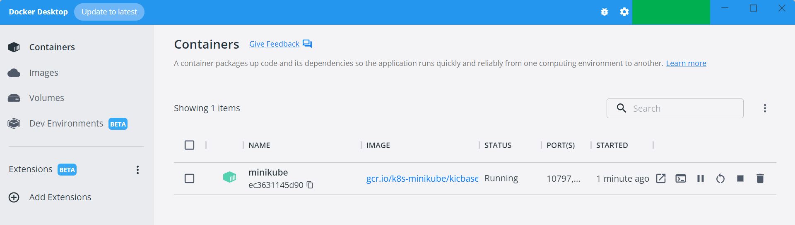
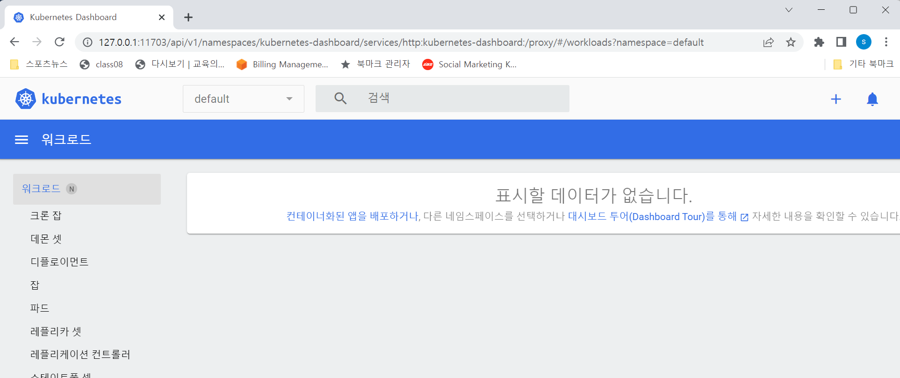

### Infra. Minikube 설치하기

MS 윈도우에서 설치가 꽤 복잡할 줄 알았다. 그런데 choco 가 설치되어 있다면 의외로 간단해서 조금 놀랐다.<br>

<br>


### 참고자료

- [minikube.sigs.k8s.io/docs/start](https://minikube.sigs.k8s.io/docs/start/)


<br>


### 사전 설치 필요한 것

- Docker Desktop

<br>


### 설치

> 개인용도의 개발PC가 MS윈도우여서 윈도우에서의 설치만 정리.
>
> MacOS, Linux 설치는 찾아보니 쉽다.


git bash 를 관리자 권한으로 실행한다.

choco 패키지 매니저가 있다면 choco 를 이용해 minikube 를 설치하자.

```bash
$ choco install minikube
```

<br>


### 실행

```bash
$ minikube start
```

<br>


minikube start 를 처음 실행 할 때는 뭔가 다운받는다는 메시지가 꽤 많이 나온다. 설치가 완료되면 Docker Desktop 에 minikube 라는 컨테이너가 로딩되어 있음을 확인할 수 있다.



<br>


### 동작 확인

```bash
$ kubectl get po -A
NAMESPACE     NAME                               READY   STATUS    RESTARTS      AGE
kube-system   coredns-787d4945fb-mpkdr           1/1     Running   0             28m
kube-system   etcd-minikube                      1/1     Running   0             28m
kube-system   kube-apiserver-minikube            1/1     Running   0             28m
kube-system   kube-controller-manager-minikube   1/1     Running   0             28m
kube-system   kube-proxy-d8m5s                   1/1     Running   0             28m
kube-system   kube-scheduler-minikube            1/1     Running   0             28m
kube-system   storage-provisioner                1/1     Running   2 (28m ago)   28m

```

<br>


대시보드 확인

```bash
$ minikube dashboard
```

<br>


명령어를 실행하고 나면 아래 그림처럼 대시보드가 나타난다.



<br>


### minikube 명령어들

- minikube pause
  - 미니큐브 pause
- minikube unpause
  - 미니큐브 pause 된 것을 다시 활성화
- minikube stop
  - 미니큐브 정지
- minikube start
  - 미니큐브 Start
- minikube config set memory 9999
  - 기본 메모리 사이즈를 지정한다. 재시작해야 한다.
- minikube addons list
  - minikube 배포판에의 해 설치된 서비스들이 출력된다.
  - 아무것도 안했는데 별에 별게 다 설치되어 있다.
- minikube start -p aged --kubernetes-version=v1.16.1
  - minikube 를 특정 버전의 쿠버네티스 릴리즈에서 구동한다.
- minikube delete --all
  - 모든 minikube cluster들을 지운다.

