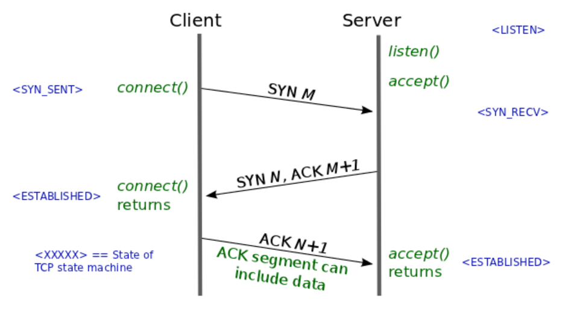
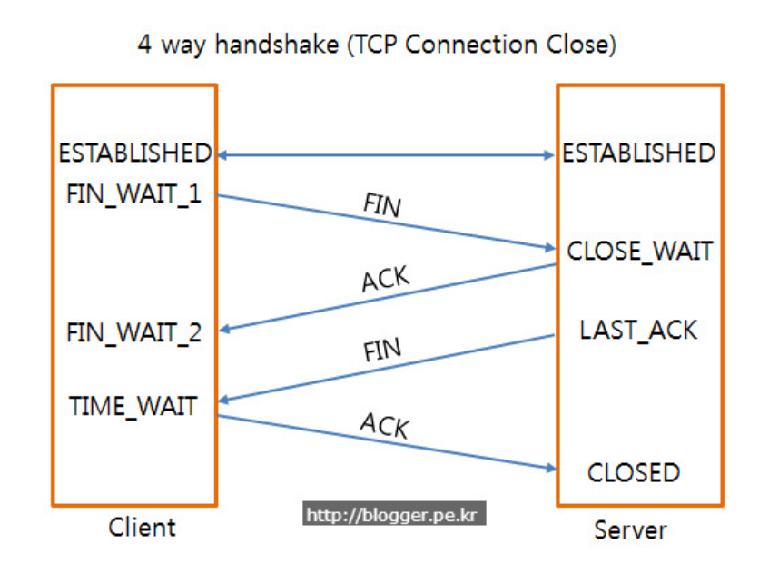

### 네트워크, TCP, UDP, HTTP

### 브라우저에 google.com 을 입력했을 때의 동작을 설명해보면?

구글 입력 

  ↓

검색엔진 도착 

- URL 파싱, 문자열 변환 (Base64 Encoding 등) 을 거친 후 검색엔진으로 텍스트 정보 전달

  ↓

DNS 에서 IP 주소 가져오기 

- 브라우저 DNS Cache 조회 → 없으면 OS DNS Cache 조회 → 없으면 Router DNS Server 조회 → Root DNS Server 조회

  ↓

Server 와 TCP Socket 열기 

- TCP 3 Way Handshake

  ↓ 

Server 에 HTTP 로 Resource 요청하기 

- Server 에 Request 보내기

  ↓ 

Browser Page Rendering

- Server 의 Response 를 바탕으로 브라우저 렌더링

 

### OSI 7계층

- 1\) 물리 (Physical)  : 전기적 신호로 변환, 송수신 기능
  - 리피터, 케이블, 허브
- 2\) 데이터링크 (Data Link) : 
  - 브릿지, 스위치
  - MAC 주소를 통해 통신. 프레임에 MAC 주소를 부여하고 에러 검출, 재전송, 흐름 제어를 진행한다.
  - 즉, 물리 계층으로 정보를 송수신하고 재전송, 흐름제어등을 담당
- 3\) 네트워크 (Network) :
  - 라우터, IP
  - 라우터를 통해서 이동할 경로를 선택, IP 주소를 지정, 해당 경로를 따라서 패킷을 전달 
  - 라우팅, 흐름제어, 오류제어, 세그먼테이션을 수행
  - 데이터를 목적지까지 안전하고 빠르게 전달하는 기능을 담당.
- 4\) 전송 (Transport)
  - TCP, UDP
  - 포트를 열어두고 프로그램들이 전송할 수 있도록 하는 역할
- 5\) 세션 (Session)
  - API, Socket
  - TCP/IP 세션을 만들고 없애는 책임
  - 데이터가 송수신하기 위한 논리적 연결
- 6\) 표현 (Presentation)
  - JPEG, MPEG 등
  - Encoding/Decoding. 파일 인코딩, 명령어 포장, 압축, 암호화 수행
- 7\) 응용 (Application)
  - HTTP, FTP, DNS
  - 응용프로세스와 직접 연계되어 응용서비스들을 수행.
  - 전자우편, 데이터베이스, HTTP 등 여러가지 서비스를 제공

 

### TCP/IP 4계층

| TCP/IP 4계층                       | 역할                                             | 데이터 단위  | 전송주소 | 예시                                                    | 장비           |
| ---------------------------------- | ------------------------------------------------ | ------------ | -------- | ------------------------------------------------------- | -------------- |
| 응용 계층(Application)             | 응용프로그램 간의 데이터 송수신                  | Data/Message | -        | 파일 전송, 이메일, FTP, HTTP, SSH, Telnet, DNS, SMTP 등 | -              |
| 전송 계층(Transport)               | 호스트 간의 자료 송수신                          | Segment      | Port     | TCP, UDP, RTP, RTCP 등                                  | 게이트웨이     |
| 인터넷 계층(Internet)              | 데이터 전송을 위한 논리적 주소 지정 및 경로 지정 | Packet       | IP       | IP, ARP, ICMP, RARP, OSPF                               | 라우터         |
| 네트워크 연결 계층(Network Access) | 실제 데이터인 프레임을 송수신                    | Frame        | MAC      | Ethernet, PPP, Token Ring 등                            | 브리지, 스위치 |

1\) L4 응용 계층 (Application Layer)

- FTP, HTTP, SSH, Telnet, DNS, SMTP 
- 소프트웨어 Application 과 통신하는 계층. Application 이 데이터를 교환하기 위해 사용하는 계층.
- 전송주소 : - , 데이터 단위 : Data/Message
- 장비 : -

2\) L3 전송 계층 (Transport Layer)

- TCP, UDP, RTP, RTCP

- 통신 노드 간의 연결 제어, <u>자료 송수신</u>을 담당
- 전송 주소 : Port , 데이터 단위 : Segment
- 장비 : 게이트웨이

3\) L2 인터넷 계층 (Internet Layer)

- IP, ARP, ICMP, RARP, OSPF
- 데이터 전송을 위한 논리적 주소 지정 및 경로 지정
- 전송 주소 : IP, 데이터 단위 : Packet
- 장비 : 라우터

4\) L1 네트워크 연결 계층 (Network Access Layer)

- Ethernet, PPP, Token Ring
- 실제 데이터인 프레임을 송수신
- 전송 주소 : MAC, 데이터 단위 : Frame
- 장비 : 브리지, 스위치

 

### 웹 서버 소프트웨어(Apache, Nginx)는 OSI 7 계층 중 어디서 작동하는지 ?

웹 서버는 OSI 7 계층인 Application Layer 에 위치합니다.

대표적으로 Apache, Nginx 등의 웹서버를 예로 들 수 있습니다.

 

### 웹 서버 소프트웨어(Apache, Nginx)의 서버 간 라우팅 기능은 OSI 7 계층 중 어디서 작동하는지 ?

서버 간 라우팅 기능은 OSI 7 계층의 3 계층인 네트워크에서 동작합니다. 

참고) 네트워크 계층에서 사용되는 하드웨어는 라우터/IP 를 예로 들 수 있다.

참고) 라우터는 다른 네트워크와 통신하기 위해 사용하는 장치인데, 현재의 네트워크에서 다른 네트워크로 패킷을 전송한다.

 

---

### DNS(Domain Name System)란?

브라우저 주소창에 Host Domain Name을 입력했을 때 해당 문자를 IP 주소로 변환해주는 시스템입니다. 원래 웹 브라우저는 IP주소를 통해 상호작용합니다. 하지만 사람이 영문과 숫자로 이루어진 복잡한 주소를 기억할 수 없기 떄문에 우리는 주로 사람이 읽을 수 있는 도메인 이름으로 주소를 기억합니다. 따라서 이 도메인 주소를 통신할 수 있도록 인터넷 통신망 규약인 TCP/IP 네트워크 상의 주소로 바꾸어주는 역할이 필요하고, DNS가 그 역할을 합니다.

 

### 3 way handshake, 4way handshake 란 ?

참고 : [3way handshake, 4way hand shake](https://asfirstalways.tistory.com/356) 

 

3 way handshake

- **3 way handshake 방식은 연결 수립(Connection Establishment)을 하는 데에 사용**된다.

4 way handshake

- **4 way handshake 방식은 연결을 종료할 때에 사용**된다.

 

### 3 way handshake : 연결 수립(Connection Establishment)

**3 way handshake 는 커넥션을 수립(연결수립)할 때 사용된다.**

1\) 클라이언트는 서버에 SYN(a) 패킷을 보낸다. 
2\) 서버는 클라이언트의 요청인 SYN(a)를 받는다. 그리고 클라이언트에게 ACK(a+1), SYN(b) 가 설정되어 있는 패킷을 보낸다. 
3\) 클라이언트는 서버에게서 ACK(a+1), SYN(b) 를 수신한다. 그리고 ACK(b+1)를 서버로 보내면 연결이 성립(establish) 된다. 
 

 

### 4 way handshake : 연결 해제(Connection Termination)

**4 way handshake 는 연결을 해제할 때 사용된다.**

 

1\) 클라이언트 → 서버 (FIN)  

클라이언트는 연결을 종료하겠다는 FIN 플래그를 전송한다. 

2\) 서버 → 클라이언트 (ACK) 

서버는 클라이언트의 요청(FIN)을 받고 알겠다는 확인 메시지로 ACK 를 보낸다. 

2-1\) 잔여 데이터 송신 작업(TIMEOUT 상태)  

데이터를 모두 보낼 때 까지 잠시 TIME OUT 상태가 된다. 

3\) 서버 → 클라이언트 (FIN) 

데이터를 모두 보내고 통신이 끝나면, 연결이 종료되었다고 클라이언트에게 FIN 플래그를 전송한다. 

4\) 클라이언트 → 서버 (ACK) 

클라이언트는 FIN 메시지를 수신한다. FIN 메시지를 수신했다는 것을 서버에 알려주어야 하기에 확인했다는 메시지(ACK)를 보낸다. 

5\) 서버 → 클라이언트 (CLOSE 작업) 

클라이언트로부터 ACK 를 수신하고 소켓 연결을 CLOSE 한다. 

6\) 클라이언트 (일정 시간 TIME_WAIT) 

클라이언트는 아직 서버로부터 받지 못한 데이터가 있을수 있기에 일정 시간 동안 세션을 남겨두고 잉여 패킷을 기다리는 과정을 거친다. (TIME_WAIT) 

 

### SYN, ACK 패킷을 설명해보세요

 

### 랜덤 넘버를 매기는 이유

 

### TCP, UDP 비교

#### TCP

연결확인 메시지를 주고받는다.

웹, 메일 등 연결 확인이 필요한 서비스에 사용된다.

 

#### UDP

확인/응답 생략한다.

VoIP 처럼 손실이 나더라도 데이터 전달에는 문제 없는 경우에 사용

 

### 사용자가 웹브라우저를 통해 서버에 이미지를 요청해서 사용자에게 보여주기까지 과정을 설명하세요.

1. 웹 브라우저가 https://www.google.com/images/google.png로 이미지를 요청 해야 한 다는 것을 인지 한다.

2. 웹 브라우저는 URL을 이용해 서버의 IP를 추출한다.

- DHCP 서버에서 자신의 IP주소, 가까운 라우터 IP, 가까운 DNS 서버 IP 수신
- DNS 서버에 요청해서 URL에 해당하는 IP 주소를 수신한다
  - 통신사별 DNS -> Root 네임서버 -> .com 네임버서로 단계별 DNS query
  - DNS서버도 계층화 되어있다(최상단 DNS서버 전세계 13개)
- IP주소를 받은 후, ARP를 통해 해당 IP주소의 MAC주소를 추적한다
  - LAN일 경우, 라우팅 테이블에서 찾고
  - 아닐 경우, Gateway 통해 밖으로 나가 해당 MAC 주소를 찾아낸다        

 (1) 웹브라우저는 서버와 TCP 커넥션을 맺는다. (3-way-handshaking)

  - Client는 SYN(a) 패킷을 보낸다.
  - Server는 응답으로 ACK(a+1)과 포트를 열라는 SYN(b)를 보낸다.
  - Client는 응답으로 ACK(b+1)를 보내며 연결이 성립된다.       

 (2) 이미지를 요청하기 위한 HTTP 요청 메세지를 만든다.

  - GET Method, /google.png를 요청하는 메시지이다       

 (3) 웹브라우저는 서버에 HTTP요청을 보낸다. 서버와 TCP 커넥션을 끊는다. (4-way-handshaking)     

  - Client는 연결을 끊겠다는 FIN을 보낸다.
  - Server는 응답으로 ACK를 보낸다.
  - Server는 통신이 끝날때까지 기다렸다가 마치면, 연결 종료 FIN을 보낸다.
    (CLOSE)
  - Client는 ACK를 보낸다.
  - Server는 Socket을 close한다.
  - Client는 아직 전송받지 못한 데이터가 있을 것을 대비해 기다린다.(TIME_WAIT)      

 (4) 서버는 메세지를 받고 무슨 내용인지 해석한다. Get Method /google.png

  - Httpd(Apache, Nginx..)가 요청을 수신한다.
    (5) 서버는 해당 Resource 있는지 찾는다.

 (6) 서버는 클라이언트와 TCP컨넥션을 맺는다. (3-ways-handshaking)

 (7) 찾으면 Status Code 200인 메세지와 함께 HTTP응답 메세지를 작성한다.

 (8) 서버는 클라이언트에 HTTP 응답을 보낸다.

 (9) 커넥션이 닫히면 웹브라우저는 사용자에게 이미지를 보여준다.

  - 구문분석 (HTML, CSS, JS) + 렌더링 ( DOM Tree 구성 - 렌더 트리 구성 렌더트리 레이아웃 배치 - 렌더트리 그리기 )
  - HTML parsing, CSS parsing, Page Rendering, GPU Rendering 을 통해 그림을 그려냄

 
