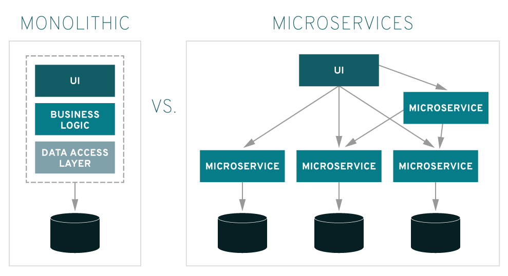

### 모놀리딕 vs MSA

### 참고자료

- [https://daaa0555.tistory.com/457](https://daaa0555.tistory.com/457)

- [https://born-dev.tistory.com/39](https://born-dev.tistory.com/39)

 

### 모놀리딕 vs 마이크로 서비스

 

모놀리딕

- 전통적인 아키텍처를 의미한다. 소프트웨어의 모든 구성요소가 하나의 프로젝트에 통합하고 있는 형태를 의미한다.
- 모든 비지니스 기능들이 단일 서비스에서 실행된다.
- 이런 이유로 애플리케이션의 하나의 기능에 대한 수요가 급증하면 해당 아키텍처 전체를 확장하게 된다.
- 코드베이스가 증가하면 모놀리딕 애플리케이션의 기능을 추가하거나 개선하기 복잡해진다.

 

마이크로서비스

- 하나의 애플리케이션을 여러 개의 작은 유닛 들로 기능 단위로 서비스 유닛으로 쪼개어 변경 및 조합이 가능하도록 만든 아키텍처를 의미한다.
- 애플리케이션이 독립적인 구성 요소로 구축되기 때문에, 각 애플리케이션 프로세스가 서비스로 실행된다.
- 마이크로서비스는 RPC나 MQ 등을 활용해 애플리케이션 간의 통신을 할 수 있도록 구성하고 이것을 통해 상호 통신이 가능하다.
- 서비스가 독립적으로 실행되기 때문에 애플리케이션의 특정 기능에 대한 수요를 충족하도록 각각의 서비스를 개별적으로 업데이트,배포,확장하는 것이 용이하다.

 

### 모놀리딕과 비교했을 때 마이크로 서비스의 장단점

장점

배포의 편리함.

- <u>서비스별 개별 배포가 가능해진다.</u> 배포 시 전체 서비스의 중단이 없다.

- <u>독립적인 서비스이기에 배포가 빠르다.</u> 모노리딕보다는 가볍다.

각각의 서비스를 독립적으로 운영

- 서비스를 분리 후에 개발하기 때문에 <u>서비스마다 가장 적합한 기술을 선택할 수 있다.</u>

- <u>서비스 별로 개별적인 서버로 나눌 수 있다.</u> 따라서 메모리,cpu 관리가 효율적이다.

이벤트 지향적인 개발, 결합도와 의존성이 낮아진다.

- 모듈화 되어 있는 각 서비스간에 <u>RPC기반으로 Message-driven 하게 통신</u>을 하기 때문에 각 서비스의 개발 속도가 증가한다.

장애격리, 복구 편리

- 서버, 프로세스 장애 시에 격리, 복구가 쉽다는 장점이 있다.
- 이렇게 서비스별로 격리가 되어있기에 <u>전체 서비스로 장애가 전파되지 않는다</u>는 장점이 있다.

 

단점

- 서비스 간 호출 시 REST API 사용으로 인한 통신비용, Latency(지연시간)가 증가한다.
- 각각 배포된 서비스에 대해 다른 서비스와 연동이 잘 되는지 일일이 확인해야 한다.
- 서비스가 분산되어 있어 트랜잭션 관리, 장애 추적, 테스트가 쉽지 않다.
  - 개별적으로 모두 모니터링 해야 한다는 단점
- 전체 서비스가 커지면 커질 수록 복잡도가 더 커질수 있다는 단점이 있다.

 

### 클러스터링 (톰캣) 이란?

- [http://it-archives.com/222215439006/](http://it-archives.com/222215439006/)

- [https://fliedcat.tistory.com/6](https://fliedcat.tistory.com/6)

 

여러 대의 WAS가 세션을 공유하는 것을 의미한다. 이렇게 하면 한 대의 was가 죽어도 나머지 was가 세션을 유지시켜준다.