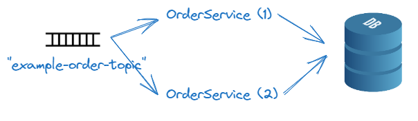
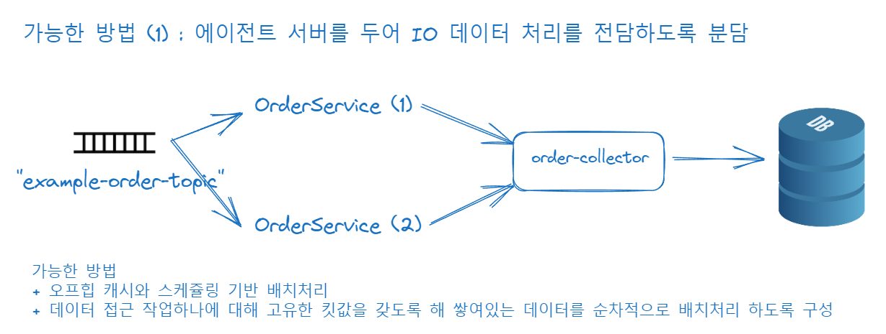
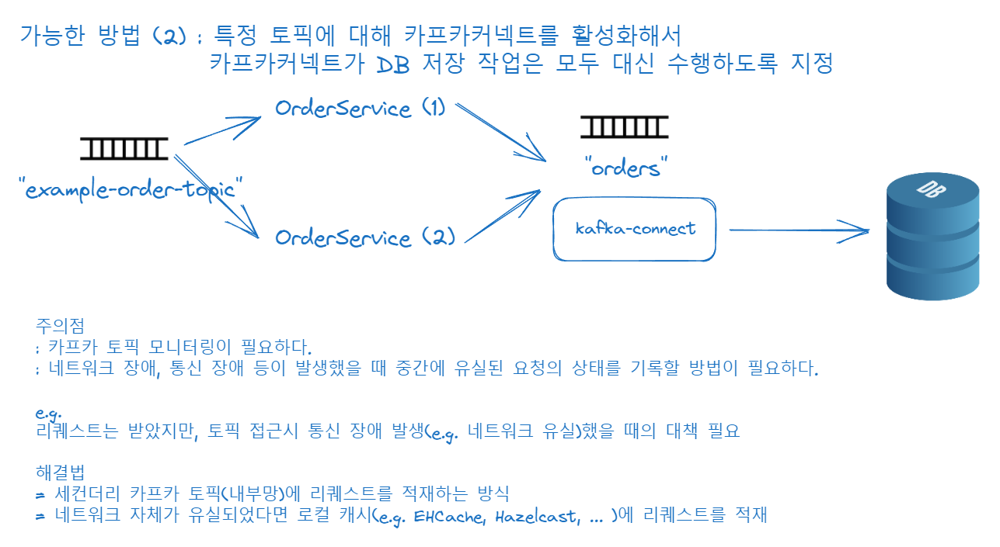
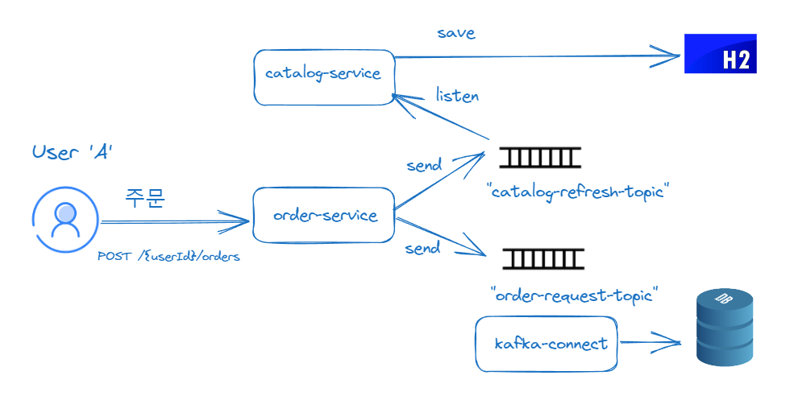

### MSA 간의 데이터 동기화

- MSA 시스템에서 데이터의 중복 이슈와 해결방법들
- 메시지 큐를 통한 데이터 동기화 

### MSA 시스템에서 데이터의 중복 이슈

예를 들어 OrderService 가 pod 으로 띄워지고 이것이 레플리케이션되도록 배포(Deployment) 되었다고 해보자.

이때 여러개의 인스턴스로 띄워진 OrderService가 DB에 접근해 데이터의 저장/삭제/수정 등의 연산을 할때 데이터의 모호함이 발생한다. 두 MSA 가 같은 트랜잭션에서 실행되고 있는 상태가 아니기 때문이다.

 

#### 해결법 1\) 에이전트 서버를 두는 방식

이 경우 중간에 에이전트 서비스를 두어 데이터를 처리하게 하는 방법이 있다. 이 경우 데이터의 중복을 해결해야 한다. 일반적으로는 들어온 이벤트 각각을 IO작업으로 취급하고 작업 각각에 고유한 킷값(e.g. 시간 + 기본키 + 상품코드 등)을 부여해 이것을 스케쥴링 기반으로 배치처리 할 수 있다. 

> 전 직장인 웨이커에서 증권 거래 체결 데이터의 일/시/분/초 집계 후 저장하는 것을 이런 방식으로 처리했고, Postgresql 특유의 Vaccum을 주기적으로 해줘야 하는데, 인프라팀 에서 대응이 매번 늦었던 이슈가 있었던 점 외에는 장애가 없었다.
>
> 다만 팀에서 RabbitMQ 외에 카프카 등에 부정적인 인식이 있었기에 모든 스케쥴링, 오프힙캐시 기반 지연된 배치처리 등의 아이디어를 카프카 시스템 기본 개념서를 보고 차용해온 개념들이 꽤 많다. 블록체인 내부의 코어도 대부분 오프힙 캐시를 쓴다고 하니 오프힙 캐시를 정말 업계에서는 많이 사용되는 듯 해보인다.

 

#### 해결법 2\) 카프카 커넥트가 데이터의 저장을 담당하도록 하는 방식

이 경우 역시 단점은 있다.

카프카 토픽 모니터링을 잘 해야 한다는 점이다. 이 외에도 네트워크 장애, 통신 장애 등이 발생했을 때 유실된 요청에 대해 기록을 해야 한다. 트랜잭션을 실패한 리퀘스트는 별도의 세컨더리 토픽에 저장하거나 로컬 캐시나 마운트 된 네트워크 볼륨에 기록하는 방식이 필요하다. 

가끔 면접 때 "네트워크 장애가 났을 때 어떻게 데이터를 동기화할 것인지?" 를 물어보는 경우가 있다. 

내 경우는 오프힙 캐시 등에 기록하는 방식을 이야기했었고, 면접관 님은 '장애 기록 토픽'에 기록하는 것이 모범답안 처럼 이야기한 경우가 있다. 그런데 네트워크 장애가 나면 카프카에 접속도 안되는 상황이 있을 수 있다는 점은 기억해야 한다. 

 

### 메시지 큐를 통한 데이터 동기화

사용자가 order-service 로 주문을 한다. 주문이 생성된다. 그런데, 웹에도 현재 이 상품의 주문 수를 업데이트 해줘야 한다. 웹에 상품의 주문 수량을 업데이트하는 MSA 는 catalog-service 라고 하자

다양한 방법이 있겠지만 위의 그림 처럼 하는 경우를 정리해보면 아래와 같다.

- 사용자는 주문이 생성 요청을 한다.
- order-service 는 이것을 저장하기 위한 토픽인 `order-request-topic` 에 요청을 쌓는다. 그리고 `order-request-topic` 에는 kafka-connect 를 구동시켜둔 상태다. 따라서 kafka-connect 가 데이터 저장을 담당한다.
- order-service 는 order-request 역시 catalog-service 에 동기화시켜줘야 한다. catalog-service 와 order-service 는 `catalog-refresh-topic` 을 바라보고 있다. 따라서 order-service는 요청이 발생했음을 알리는 `catalog-refresh-topic` 에 주문수량에 대한 이벤트를 전달한다. 그리고 catalog-service 는 `catalog-refresh-topic` 을 listen 하고 있다가 이벤트가 발생하면 이것을 H2에 저장하거나 SSE로 클라이언트에 렌더링하는 작업을 수행한다.

 

### 카프카 메시징 트랜잭션 처리

메시징이 실패하는 경우에도 rollback 등의 동작이 필요하다. 이 부분은 카프카 개념에 해당하는 개념이기에 이번 문서의 주제에서 벗어나서 카프카 트랜잭션 관련된 자료들만 남겨두기로 했다. 

- [광고정산 시스템에 Kafka Streams 도입하기](https://www.bucketplace.com/post/2022-05-20-%EA%B4%91%EA%B3%A0-%EC%A0%95%EC%82%B0-%EC%8B%9C%EC%8A%A4%ED%85%9C%EC%97%90-kafka-streams-%EB%8F%84%EC%9E%85%ED%95%98%EA%B8%B0/)

 

### etc

카프카는 만능이 아니다. 요청이 늘어나면 MSA가 늘어나게끔 탄력성을 가지고 있어야하고, 이것을 수신하는 카프카측도 설정이 잘 세팅되어 있어야 한다. 이 부분은 주의해야 한다. 

그리고 가끔가다가 kafkaTemplate.send() 등이 ConcurrentKafkaListenerContainerFactory 를 기반으로 수행되도록 하면 그냥 `비동기` 적으로 수행한다고 맹신하는 사람들이 많다. 하지만, 네트워크 통신은 기본적으로 블로킹이다. TCP/IP 기반으로 채팅을 짜봤다면 누구나 이해가 가능하다.  

카프카 역시 내부적으로는 물리적인 블로킹기반인 TCP/IP 통신을 비동기 스레드와 스레드 풀을 통해서 kafka-client 라이브러리 내에서 최적화해둔 것일 뿐이지 그냥 가져다 쓴다고 그 순간부터 비동기 전송이 되지는 않는다. 

만약 요청이 폭증해 장애가 발생한다면, 카프카 클러스터를 최적화할 지 MSA 구성을 조금 더 유연하게 할지 MSA측이 장애가 덜한지, 카프카 클러스터 측이 부하가 심한지를 잘 판단해서 적절한 대응이 필요하다. MSA측이 장애가 더 많다면 인스턴스의 복제수를 늘리거나 Deployment 구성을 조금 더 하드웨어를 많이 사용하도록 하거나 하는 등의 설정을 하는 선택을 할 수 있을 것 같다.  

물론 이 정도로 트래픽이 몰리는 경우는 증권 거래 데이터 말고는 거의 없지 않을까 싶다. 

 

