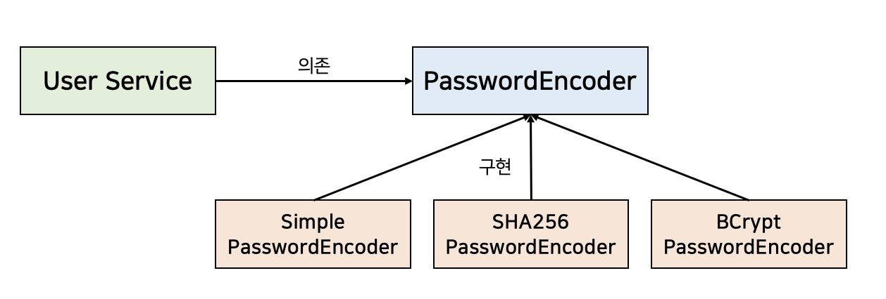

### SOLID 란? (요약)

- SRP (Single Responsibility Principle)

  - 모듈이 변경되는 이유는 한가지여야 함을 의미
  - 하나의 모듈이 하나의 책임을 가져야 한다는 의미로 오해되는 경우가 있다. 주의 필요
  - 로버트 마틴은 SOLID 원칙 중 가장 의미가 전달되지 못한 것으로 SRP를 뽑았다.
  - e.g. UserService::addUser(email, pw) 내에서 DB 저장 외에 추가로 존재하는 비밀번호 암호화 코드를 SimplePasswordEncoder::encryptPassword(pw) 로 분리하는 예.
    - UserService 내의 addUser(email:String, pw:String) 메서드가 있다고 해보자. addUser (email, pw) 메서드는 비밀번호 암호화 후에 DB에 User 객체를 저장하는 역할을 한다. 그리고 모든 로직이 addUser(email, pw) 에 통으로 작성되어 있다.
    - 그런데 비밀번호 암호화 방식을 변경해야 하는 비즈니스 요건이 발생했다고 해보자. 
    - 비밀번호 암호화 방식을 변경해야 하는데 addUser(email, pw) 메서드 까지 수정하게 됐다.
    - 이것을 고치기 위해 SRP 를 적용해서 SimplePasswordEncoder 라는 클래스에 `encryptPassword(pw)` 를 정의하고 UserService 에서는 SimplePasswordEncoder 의 객체만 소유하고 있게끔 하는 식으로 변경해줬다. 이렇게 해서 비밀번호 암호화 방식을 변경할 때에는 SimplePasswordEncoder 내의 `encryptPasword(pw)` 만 수정하면 되게끔 되었다.

- OCP (Open Closed Principle)

  - 개방-폐쇄 원칙

  - 변하지 않는 부분은 고정하고 변하는 부분을 생략하여 추상화

  - 확장에 대해 닫혀있다 : 요구사항 변경 시 새로운 동작을 추가해서 애플리케이션의 기능을 확장할 수 있다.

  - 변경에 대해 닫혀있다 : 기존의 코드를 수정하지 않고 애플리케이션에 새로운 기능이 추가되거나 변경될 수 있다.

  - e.g.

    - UserService 는 아직 까지는 SimplePasswordEncoder 의 인스턴스를 가지고 있다. 그런데 SHA256 방식의 패스워드 암호화 방식을 추가해 달라는 요구사항이 발생했다.

    - SHA256 방식의 패스워드 암호화는 SHA256PasswordEncoder 클래스로 정의했다.

    - 문제점: 멤버 필드 선언 문도 함께 고쳐야 한다는 점 

      - 이 때 UserService 내의 멤버필드로 선언한 `private final SimplePasswordEncoder passwordEncoder;` 구문을 `private final SHA256PasswordEncoder passwordEncoder;` 로 변경해줘야 한다. UserService는 분명 회원 가입, 인증 기능을 처리하는 것이 목적인 클래스인데 암호화 기능을 수정해야 하는 경우에도 함께 변경되고 있다.

    - 해결 : PasswordEncoder 인터페이스 정의, 추상화 + 세부 클래스들이 implements 하도록 변경

      - 위와 같은 비밀번호 암호화 변경에 대한 종속성을 없에기 위해 `PasswordEncoder` 라는 interface를 만들고 `public String encryptPassword(password: String);` 라는 추상 메서드를 추가해줬다. 그리고 SimplePasswordEncoder, SHA256PasswordEncoder 클래스 각각은 `PasswordEncoder` 인터페이스를 implements 하게끔 수정해줬다.
      - UserService 내의 멤버 필드 역시 `private val passwordEncoder : PasswordEncoder` 로 변경

      - 이렇게 UserService가 추상 타입을 참조하도록 해주고 구체적인 인스턴스는 외부에서 주입받도록 해주면, UserService 클래스는 변경에 대해 닫혀있는 객체가 된다.

- LSP (Liscov Substitution Principle)

  - 리스코프 치환 원칙
  - 하위타입은 상위타입을 대체할 수 있어야 한다.
  - e.g. "정사각형은 직사각형이다."

- ISP (Interface Segragation Principle)

  - 인터페이스 분리 원칙
  - 인터페이스를 **목적과 관심에 따라 적절하게 분리해야 한다**는 원칙
  - 클라이언트의 **목적과 용도에 적합한 인터페이스만을 제공**하는 것
  - 구체 타입 내의 특정 public 메서드를 interface 로 분리. 구체 타입 내의 public 메서드를 노출하는 것을 용도에 따라 interface 에 따라 다르게 접근할 수 있게끔 해주는 방식이다.
  - ISP를 지키면 각각의 관심에 맞는 퍼블릭 인터페이스만을 접근해 불필요한 간섭을 최소화하게 된다.
  - 인터페이스를 쓰더라도 용도에 따라 여러 인터페이스로 분류해서 쓰자.
  - 하나의 인터페이스에 몰아서 쓰기보다는 용도에 따라 분류
  - e.g. 파일 읽기/파일 쓰기 기능 구현 클래스 → 클라이언트가 읽기만을 필요할 경우 읽기 인터페이스를 만들어 제공
  - e.g. PasswordChecker, PasswordEncoder : interface 로 분리. 구체 타입 내의 public 메서드를 노출하는 것을 용도에 따라 분리해야 한다면 좋은 분리 원칙이다.
    - 현재 PasswordEncoder 인터페이스에는 encryptPassword(pw) 만 있는 상태다. 그런데 SimplePasswordEncoder 내에 isCorrectPassword(rawPw, pw) 역시 추가해줬다. 이 isCorrectPassword(rawPw, pw) 는 별도의 interface 인 PasswordChecker 에 따로 추상화를 해준다면 좋다. 
    - 문제점 : isCorrectPassword(rawPw, pw) 메서드가 PasswordEncoder 타입으로도 접근이 가능한 상태라는 점
      - 이때 SimplePasswordEncoder 내에 isCorrectPassowrd(rawPw, pw) 함수를 단순하게 추가만 해주는 경우를 생각해보자. 이렇게 한다면, PasswordEncoder 라는 타입으로 선언된 모든 필드들도 isCorrectPassword(rawPw, pw) 에도 접근이 가능해진다는 문제점이 생긴다. 즉, 암호화 객체에서 비밀번호 일치여부 체크 기능까지 접근이 가능해진다. 
      - 만약 Authentication 이라는 객체에서는 isCorrectPassword (rawPw, pw) 만 필요한데, PasswordEncoder 내의 encryptPassword(pw) 까지 접근이 가능하다면 이것은 문제가 있다. 
    - 해결 : PasswordChecker 인터페이스 정의, SimplePasswordEncoder, SHA256PasswordEncoder 는 이것을 implements한다. 
      - PasswordChecker 라는 인터페이스를 정의한다. 그리고 PasswordChecker 인터페이스에는 `boolean isCorrectPassword(String pw);` 를 추상 메서드로 추가해줬다.
      - PasswordChecker 가 필요한 Authentication 클래스에서는 PasswordChecker 라는 interface 타입으로 SimplePasswordChecker, SHA256PasswordChecker 인스턴스를 외부에서 주입받게끔 수정해줬다.
      - 이렇게 해서 Authentication 내에서 passwordChecker 필드로 `encryptPassword(pw)` 를 접근하게 될수 있는 가능성을 제거해줬다.

- DIP (Dependency Inversion Principle)

  - 의존성 역전 원칙
  - 고수준 모듈은 저수준 모듈의 구현에 의존해서는 안되며, 저수준 모듈이 고수준 모듈에 의존해야 한다는 것
  - 비즈니스와 관련된 부분이 세부사항에는 의존하지 않는 설계 원칙을 의미


### SRP (Single Responsibility Principle)

- **모듈이 변경되는 이유는 한가지여야 함을 의미**
- 하나의 모듈이 하나의 책임을 가져야 한다는 의미로 오해되는 경우가 있다. 주의 필요
- 로버트 마틴은 SOLID 원칙 중 가장 의미가 전달되지 못한 것으로 SRP를 뽑았다
- 단일책임원칙을 잘 지키면 변경이 필요할 때 **수정할 대상이 명확**해진다.
- 단일책임원칙은 시스템이 커지면 극대화된다.
- 변경해야 하는 것이 있을 때 1가지만 수정하면 되기 때문이다.


#### e.g. before

고치기 전의 코드다. 모듈화가 이뤄지지 않은 코드다.

```java
@Service
@RequiredArgsConstructor
public class UserService {

	private final UserRepository userRepository;

	public void addUser(final String email, final String pw) {
		final StringBuilder sb = new StringBuilder();

		for(byte b : pw.getBytes(StandardCharsets.UTF_8)) {
			sb.append(Integer.toString((b & 0xff) + 0x100, 16).substring(1));
		}

		final String encryptedPassword = sb.toString();
		final User user = User.builder()
				.email(email)
				.pw(encryptedPassword).build();

		userRepository.save(user);
	}
}
```


위의 UserService 에 대해 여러 액터로부터 아래와 같은 변경사항이 발생할 수 있다.

- 기획팀: 사용자를 추가할 때 역할(Role)에 대한 정의가 필요하다.
- 보안팀: 사용자의 비밀번호 암호화 방식에 개신이 필요하다.
- 기타 등등

<br>


#### e.g. after

위의 코드에서부터 비밀번호 암호화 라는 책임으로 별도로 분리해본 코드는 아래와 같다.

비밀번호 암호화 라는 책임을 encryptPassword 라는 메시지로 분류했고 이 책임은 SimplePasswordEncoder 라는 클래스에 별도로 분리했다.

```java
@Component
public class SimplePasswordEncoder {

	public void encryptPassword(final String pw) {
		final StringBuilder sb = new StringBuilder();

		for(byte b : pw.getBytes(StandardCharsets.UTF_8)) {
			sb.append(Integer.toString((b & 0xff) + 0x100, 16).substring(1));
		}

		return sb.toString();
	}
}

@Service
@RequiredArgsConstructor
public class UserService {

	private final UserRepository userRepository;
    // 2)
	private final SimplePasswordEncoder passwordEncoder;

	public void addUser(final String email, final String pw) {
        // 1)
		final String encryptedPassword = passwordEncoder.encryptPassword(pw);

		final User user = User.builder()
				.email(email)
				.pw(encryptedPassword).build();

		userRepository.save(user);
	}
}
```


사용자 추가메서드(addUser(...))에서 비밀번호 암호화 부분만을 단일 책임 원칙을 따르도록 수정했다.

1\) 

- 하드코딩 된 코드를 비밀번호 암호화라는 책임으로 분류했고, 비밀번호 암호화는 encryptPassword 라는 메시지로 이름을 지었다.
- encryptPassword() 라는 책임을 별도의 객체에 할당했다.
- 이로써 비밀번호 암호화라는 책임의 변경에 대해서는 단 하나의 객체만 수정하면 되게끔 되었다.
- 정리 필요..

2\)

- SimplePasswordEncoder 라는 별도의 객체로 분리했다.

<br>


### OCP (Open Closed Principle)

- 개방-폐쇄 원칙
- 변하지 않는 부분은 고정하고 변하는 부분을 생략하여 추상화

- 확장에 대해 닫혀있다 : 요구사항 변경 시 새로운 동작을 추가해서 애플리케이션의 기능을 확장할 수 있다.
- 변경에 대해 닫혀있다 : 기존의 코드를 수정하지 않고 애플리케이션에 새로운 기능이 추가되거나 변경될 수 있다.

<br>


#### e.g. before

변경 전의 코드다.

```java
@Component
public class SimplePasswordEncoder {

	public void encryptPassword(final String pw) {
		final StringBuilder sb = new StringBuilder();

		for(byte b : pw.getBytes(StandardCharsets.UTF_8)) {
			sb.append(Integer.toString((b & 0xff) + 0x100, 16).substring(1));
		}

		return sb.toString();
	}
}

@Service
@RequiredArgsConstructor
public class UserService {

	private final UserRepository userRepository;
	private final SimplePasswordEncoder passwordEncoder; // 1)

	public void addUser(final String email, final String pw) {
		final String encryptedPassword = passwordEncoder.encryptPassword(pw);

		final User user = User.builder()
				.email(email)
				.pw(encryptedPassword).build();

		userRepository.save(user);
	}
}
```

<br>


#### 요구사항 발생 : 새로운 암호화 방식 추가

단순한 암호화방식이 아닌 조금은 복잡한 방식인 SHA256 알고리즘 방식의 SHA256PasswordEncoder 를 사용하도록 해야 하는 요구사항이 발생했다.

그런데 UserService 는 아래와 같이 SimplePasswordEncoder 라는 구체 클래스에 대한 객체를 멤버필드로 하드코딩하고 있다.

```java
@Service
@RequiredArgsConstructor
public class UserService {

	private final UserRepository userRepository;
	private final SimplePasswordEncoder passwordEncoder; // 1)

    // ...
    
}
```


1\) 

- UserService 에 새로운 암호화방식인 SHA256PasswordEncoder 를 적용하기 위해서는 1\) 에 선언한 멤버 필드의 타입을 수정해야만 한다.

<br>


#### 문제점

기존의 코드를 수정하지 않아야 하는 OCP 원칙에 위배된다. 이러한 문제를 해결하고 개방 폐쇄 원칙을 지키기 위해서는 추상화에 의존하도록 수정해야 한다.

추상화란 핵심적인 부분만 남기고, 불필요한 부분은 제거함으로써 복잡한 것을 간단히 하는 것을 의미한다.<BR>

UserService 가 추상화에 의존하면, 구체 타입이 뭔지 알기 위해 노력할 필요가 없다.<br>

하위 타입들은 추상화 타입에 의존하면 된다.<br>

<br>


#### e.g. after 

##### UserService.java

```java
@Service
@RequiredArgsConstructor
public class UserService {

	private final UserRepository userRepository;
	private final PasswordEncoder passwordEncoder; // 1) 추상화에 의존하도록 수정 

	public void addUser(final String email, final String pw) {
		final String encryptedPassword = passwordEncoder.encryptPassword(pw);

		final User user = User.builder()
				.email(email)
				.pw(encryptedPassword).build();

		userRepository.save(user);
	}
    
}
```

<br>

PasswordEncoder 라는 이름으로 정의한 추상화 타입은 인터페이스로 정의했다.<br>


##### PasswordEncoder.java

```java
public interface PasswordEncoder {
    String encryptPassword(final String pw);
}
```

<br>


##### SHA256PasswordEncoder.java

새로운 요구사항은 PasswordEncoder 타입을 implements 하도록 수정해줬다.

```java
@Component
public class SHA256PasswordEncoder implements PasswordEncoder {

	@Override
	public String encryptPassword(final String pw)  {
      ...
	}
}
```

<br>


### LSP (Liscov Substitution Principle)

- 리스코프 치환 원칙
- 하위타입은 상위타입을 대체할 수 있어야 한다.
- 자식클래스가 부모 클래스를 대체하기 위해서는 부모 클래스에 대한 클라이언트의 가정을 준수해야 한다.
- e.g. "정사각형은 직사각형이다."
  - 직사각형을 정사각형 타입으로 분류해서 취급할 때, 정사각형에 대해 resize(w,h) 실행시 w,h가 서로 다른 인자를 전달했을 때 예외처리를 꼭 해줘야 LSP를 만족하게 된다.
  - 정사각형은 가로(w) 와 세로(h)가 길이가 같아야 하는데 정사각형 객체에 대한 resize (w, h) 수행시 w, h 가 다른 값으로 들어왔다면 정사각형에 대한 전제조건을 어기는 것이 되기 때문이다.
  - 클라이언트는 직사각형의 너비와 높이는 다를 것이라고 가정하는데 정사각형은 이를 준수하지 못한다.
- 해결방법
  - 비어있는 메서드를 호출하도록 수정하거나 호출 시에 에러를 던지는 등의 조치를 취한다.
    - 하지만 이런 방법은 클라이언트가 예측하기에는 쉽지 않다. 내부 구현을 일일이 확인해야 하므로 클라이언트가 알아야 하는 지식을 늘리는 결과를 낳는다.
  - 추상화 레벨을 맞춰 메서드 호출이 불가능하도록 하는 방법이 있다.
    - (e.g. Square 는 resize 를 호출하지 못하게하는 방식)
  - 해당 추상화 레벨에 맞도록 메서드를 오버라이딩 한다.

<br>

#### Rectangle, Square 클래스

```java
@Getter
@Setter
@AllArgsConstructor
public class Rectangle {

    private int width, height;

    public int getArea() {
        return width * height;
    }

}

public class Square extends Rectangle {

    public Square(int size) {
        super(size, size);
    }
	
    @Override
    public void setWidth(int width) {
        super.setWidth(width);
        super.setHeight(width);
    }

    @Override
    public void setHeight(int height) {
        super.setWidth(height);
        super.setHeight(height);
    }
}
```


#### resize(Rectangle rectangle, int width, int height)

```java
public void resize(Rectangle rectangle, int width, int height) {
    rectangle.setWidth(width);
    rectangle.setHeight(height);
    if (rectangle.getWidth() != width && rectangle.getHeight() != height) {
        throw new IllegalStateException();
    }
}
```

<br>


#### resize(width, height) 시 LSP 를 어기는 경우

```java
Rectangle rectangle = new Square();
resize(rectangle, 100, 150);
```

<br>


### ISP (Interface Segragation Principle)

- 인터페이스 분리 원칙
- 인터페이스를 **목적과 관심에 따라 적절하게 분리해야 한다**는 원칙
- 클라이언트의 **목적과 용도에 적합한 인터페이스만을 제공**하는 것
- ISP를 지키면 **각각의 관심에 맞는 퍼블릭 인터페이스만을 접근해 불필요한 간섭을 최소화**하게 된다.
- 인터페이스를 쓰더라도 용도에 따라 여러 인터페이스로 분류해서 쓰자.
- 하나의 인터페이스에 몰아서 쓰기보다는 용도에 따라 분류
- e.g. PasswordChecker, PasswordEncoder
  - encryptPassword 라는 기능은 별도의 퍼블릭 인터페이스로 제공한다면 기능의 분리가 가능하다.
  - isCorrectPassword 라는 기능은 별도의 퍼블릭 인터페이스로 제공한다면 기능의 분리가 가능하다.
- e.g. 파일 읽기/파일 쓰기 기능 구현 클래스 → 클라이언트가 읽기만을 필요할 경우 읽기 인터페이스를 만들어 제공
- 

<br>

#### e.g. PasswordEncoder, PasswordChecker

SHA256PasswordEncoder 라는 비밀번호 암호화 기능에는 아래의 두 기능들이 있다.

- 비밀번호 암호화
- 비밀번호 체크 기능

SHA256 비밀번호 암호화 기능에는 비밀번호 암호화, 비밀번호 체크 기능 이렇게 두 기능이 필요하지만, 상황에 따라 비밀번호 암호화 기능만 필요할 경우도 있고 비밀번호 체크 기능만 필요할 경우가 있다. <br>

UserService 에서는 encryptPassword() 라는 기능이 필요하다.

Authentication 에서는 isCorrectPassword() 라는 기능이 필요하다.


먼저 encryptPassword() 를 퍼블릭 인터페이스인 PasswordEncoder 인터페이스로 분리해두었다.

```java
public interface PasswordEncoder{
    String isCorrectPassword(final String rawPw, final String pw);
}
```


그리고 SHA256PasswordEncoder 클래스는 PasswordEncoder 라는 퍼블릭 인터페이스를 제공하도록 수정해줬다.

```java
@Component
public class SHA256PasswordEncoder implements PasswordEncoder {

	@Override
	public String encryptPassword(final String pw)  {
		...
	}

	public boolean isCorrectPassword(final String rawPw, final String pw) {
		final String encryptedPw = encryptPassword(rawPw);
		return encryptedPw.equals(pw);
	}
}
```

<br>

**문제점**<br>

- 다른 클래스에서 SHA256PasswordEncoder 타입으로 접근시 isCorrectPassword 에도 접근 가능한 문제
- isCorrectPassword 라는 기능은 별도의 퍼블릭 인터페이스로 제공한다면 기능의 분리가 가능하다.

<br>

그런데 SHA256PasswordEncoder 클래스의 isCorrectPassword(String, String) 은 여전히 외부에 공개되어있다.

만약 Authentication 클래스에서 SHA256PasswordEncoder를 의존성주입받는 경우를 생각해보자.

Authentication 클래스는 isCorrectPassword(String, String) 만 사용하면 된다. encryptPassword 는 필요없다. UserService에서 사용하는 로직이다. 그런데 위의 로직에서는 SHA256PasswordEncoder 를 의존성 주입받으면 encryptPassword(String) 까지도 접근가능해지게 된다.<br>


**해결**<br>

이 문제를 해결하기 위해 비밀번호 체크 기능을 퍼블릭 인터페이스에 정의하기로 하고, SHA256PasswordEncoder가 PasswordEncoder, PasswordChecker 라는 퍼블릭 인터페이스를 제공하도록 수정한다.

먼저 PasswordChecker 라는 퍼블릭 인터페이스를 정의한다.

```java
public interface PasswordChecker{
    boolean isCorrectPassword(String pw);
}
```

<br>

그리고 이 PasswordChecker 를 SHA256PasswordEncoder 클래스를 통해 제공하도록 아래와 같이 수정해줬다.

```java
@Component
public class SHA256PasswordEncoder implements PasswordEncoder, PasswordChecker {

	@Override
	public String encryptPassword(final String pw)  {
		...
	}

    @Override
	public boolean isCorrectPassword(final String rawPw, final String pw) {
		final String encryptedPw = encryptPassword(rawPw);
		return encryptedPw.equals(pw);
	}
}
```


이렇게 해서 Authentication 클래스에서 PasswordChecker 라는 퍼블릭인터페이스 타입을 주입받으면 isCorrectPassword 라는 메시지에만 접근이 가능해지게 된다.<br>

<Br>


### DIP (Dependency Inversion Principle)

- 의존성 역전 원칙
- 고수준 모듈은 저수준 모듈의 구현에 의존해서는 안되며, 저수준 모듈이 고수준 모듈에 의존해야 한다는 것
- 비즈니스와 관련된 부분이 세부사항에는 의존하지 않는 설계 원칙을 의미
- 의존성 역전 원칙은 개방폐쇄원칙(OCP)과 밀접하게 관련이 있다. 의존성 역전 원칙이 위배되면 개방 폐쇄 원칙 역시 위배될 수 있다.
- 의존성 역전 원칙에서 의존성이 역전되는 시점은 컴파일 시점이다.
- 런타임 시점에는 UserService 가 SHA256PasswordEncoder 라는 구체 클래스에 의존한다.
- 의존성 역전 원칙은 컴파일 시점에 의존성이 역전되는 것을 의미, UserService가 PasswordEncoder 에 의존한다.

<br>




<br>


