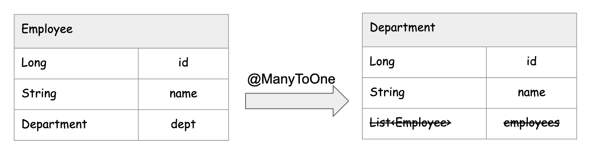
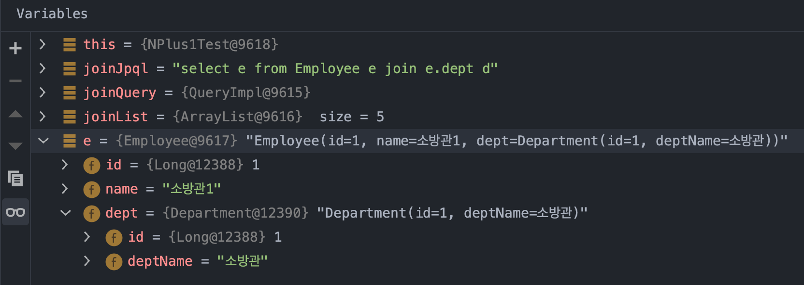

### N+1

한번의 쿼리를 실행해서 조회했지만, N번의 쿼리가 이어서 추가로 실행되는 현상.

N+1 문제가 발생하는 이유는 연관관계를 가진 엔티티를 조회할 때 한 쪽 테이블만 조회하고 다른 테이블은 따로 조회하기 때문이다. fetch join 을 사용하면, 두 테이블을 join 해서 데이터를 가져온다. 따라서 N+1 문제를 방지할 수 있다.

<br>


e.g.

- 사원 객체 n개에 대한 사원 리스트 조회 1회 + n명의 각 사원에 대한 부서명 조회 n회 = N+1


<br>


> 예제에서는 예를 확인하기 위해 약간은 억지스럽지만 Select All 을 사용했다. 실제 업무나 현업에서는 가급적 Select All 을 사용하지 않는 것을 추천한다.<br>

<br>


### 주요 해결방법

- Fetch Join 을 사용한다.
- @EntityGraph 를 사용한다.
- JdbcTemplate 을 사용한다.

<br>


### 예제 시나리오

- FetchType.LAZY 일때
- FetchType.EAGER 일때

<br>


### 엔티티 매핑 (Employee, Department (단방향))



<br>


### FetchType.LAZY 일 때의 예제

#### Employee.java

```java
@Getter
@Entity
@SequenceGenerator(
    name = "employee_sequence",
    schema = "public", sequenceName = "EMP_SEQ",
    initialValue = 1, allocationSize = 1
)
@Table(name = "EMP", schema = "public")
public class Employee {

    @Id @GeneratedValue(strategy = GenerationType.SEQUENCE, generator = "employee_sequence")
    @Column(name = "EMPLOYEE_ID")
    private Long id;

    @Column(name = "EMPLOYEE_NAME")
    private String name;

    @ManyToOne(optional = false, fetch = FetchType.LAZY)
    @JoinColumn(name = "DEPT_ID")
    private Department dept;

    public Employee(String name, Department dept){
        this.name = name;
        this.dept = dept;
    }
}
```

<br>


연관관계의 상대편인 DEPT 테이블에 대한 객체인 Department 객체를 FetchType.LAZY로 로딩하도록 설정해두었다.

<br>


#### Department.java

```java
@Entity
@SequenceGenerator(
    schema = "public", sequenceName = "DEPT_SEQ", name = "department_seq",
    initialValue = 1, allocationSize = 1
)
@Table(name = "DEPT", schema = "public")
public class Department {

    @Id @GeneratedValue(strategy = GenerationType.SEQUENCE, generator = "department_seq")
    @Column(name = "DEPT_ID")
    private Long id;

    @Column(name = "DEPT_NAME")
    private String deptName;

//    @OneToMany(mappedBy = "dept")
//    List<Employee> employees = new ArrayList<>();

    public Department(String deptName){
        this.deptName = deptName;
    }
}
```


#### 테스트 코드

테스트 코드는 아래와 같이 작성했다.

```java
@Test
@DisplayName("N_Plus_1_조회테스트")
public void N_Plus_1_조회테스트(){
  em.clear();
  List<Employee> list = repository.findAll();

  for(Employee e : list){
    String deptName = e.getDept().getDeptName();
    System.out.println(e.getName() + "의 소속부서 : " + deptName);
  }
}
```

<br>


#### 테스트 데이터

테스트 데이터는 아래와 같이 넣어두었다. @BeforeEach 에서 넣어둘 수도 있고, SQL로 생성해둬도 되고 그렇다. 그냥 대충 넣었다.


<br>


#### findAll() 시의 SQL

테스트 코드의 아래 코드 부분은 findAll() 을 하는 부분이다. 

```java
em.clear();
List<Employee> list = repository.findAll();
```


이 코드를 실행하는 부분 까지는 SELECT ALL SQL 이 1회 발생한다.

```sql
Hibernate: 
		select
            employee0_.employee_id as employee1_1_,
            employee0_.dept_id as dept_id3_1_,
            employee0_.employee_name as employee2_1_ 
        from
            public.emp employee0_
```

<br>

다만, Dept 테이블의 데이터를 결합해서 가져오지 않고 있다. 

<br>


#### 불러온 List\<Employee\> 의 각 요소로 Department 객체를 접근할 때

문제는 `List<Employee>` 의 각 요소를 for 문으로 순회하는 부분에서 발생한다.

```java
@Test
@DisplayName("N_Plus_1_조회테스트")
public void N_Plus_1_조회테스트(){
  // ...
  
  for(Employee e : list){
    // 아래 부분에서 N+1 현상이 발생한다.
    String deptName = e.getDept().getDeptName();
    System.out.println(e.getName() + "의 소속부서 : " + deptName);
  }
  
}
```

<br>


위의 코드의 `String deptName = e.getDept().getDeptName()`을 호출할 때마다 DEPT 테이블을 `dept_id` 를 통해 개별 조회하는 현상이 발생한다. 위 코드를 실행할 때의 SQL은 아래와 같다. Employee 각각에 대해 Department 를 개별조회하고 있음을 확인 가능하다.

```sql
# 참고) 이 부분은 위에서 repository.findAll() 로 호출한 부분
# (start)
Hibernate: 
		select
            employee0_.employee_id as employee1_1_,
            employee0_.dept_id as dept_id3_1_,
            employee0_.employee_name as employee2_1_ 
        from
            public.emp employee0_
# (end)

# 참고) 아래에서부터는 for(Employee e : list) 를 통해 Employee 내의 dept 필드를 개별 조회하는 부분
# (start)
Hibernate: 
    select
        department0_.dept_id as dept_id1_0_0_,
        department0_.dept_name as dept_nam2_0_0_ 
    from
        public.dept department0_ 
    where
        department0_.dept_id=?
소방관1의 소속부서 : 소방관
소방관2의 소속부서 : 소방관
Hibernate: 
    select
        department0_.dept_id as dept_id1_0_0_,
        department0_.dept_name as dept_nam2_0_0_ 
    from
        public.dept department0_ 
    where
        department0_.dept_id=?
지드래곤의 소속부서 : 가수
Hibernate: 
    select
        department0_.dept_id as dept_id1_0_0_,
        department0_.dept_name as dept_nam2_0_0_ 
    from
        public.dept department0_ 
    where
        department0_.dept_id=?
황의조의 소속부서 : 축구선수
# (end)
```


이렇게해서 Java 코드로 인해 생성된 SQL 쿼리의 호출 횟수는 아래와 같아진다.

- Select All 1회 + 각 사원에 대한 부서명 조회 n 회 = n+1 회


<br>


### FetchType.EAGER 시의 예제

FetchType.EAGER 일때에도 동일한 문제가 발생한다.

<br>


#### Employee.java

```java
@Data
@Entity
@SequenceGenerator(
    name = "employee_sequence",
    schema = "public", sequenceName = "EMP_SEQ",
    initialValue = 1, allocationSize = 1
)
@Table(name = "EMP", schema = "public")
public class Employee {

    @Id @GeneratedValue(strategy = GenerationType.SEQUENCE, generator = "employee_sequence")
    @Column(name = "EMPLOYEE_ID")
    private Long id;

    @Column(name = "EMPLOYEE_NAME")
    private String name;

    @ManyToOne(optional = false, fetch = FetchType.EAGER)
    @JoinColumn(name = "DEPT_ID")
    private Department dept;

    public Employee(){}

    public Employee(String name, Department dept){
        this.name = name;
        this.dept = dept;
    }
}
```

<br>

디버깅 모드로 Employee  의 리스트를 조회할 때에는 아래와 같이 Department 객체에 정보가 각각 세팅되어 있는 것을 확인 가능하다.<br>


#### Department.java

```java
@Entity
@SequenceGenerator(
    schema = "public", sequenceName = "DEPT_SEQ", name = "department_seq",
    initialValue = 1, allocationSize = 1
)
@Table(name = "DEPT", schema = "public")
public class Department {

    @Id @GeneratedValue(strategy = GenerationType.SEQUENCE, generator = "department_seq")
    @Column(name = "DEPT_ID")
    private Long id;

    @Column(name = "DEPT_NAME")
    private String deptName;

//    @OneToMany(mappedBy = "dept")
//    List<Employee> employees = new ArrayList<>();

    public Department(String deptName){
        this.deptName = deptName;
    }
}
```

<br>


#### 테스트코드

```java
@Test
@DisplayName("N_Plus_1_조회테스트")
public void N_Plus_1_조회테스트(){
  em.clear();
  List<Employee> list = repository.findAll();

  for(Employee e : list){
    String deptName = e.getDept().getDeptName();
    System.out.println(e.getName() + "의 소속부서 : " + deptName);
  }
}
```

<br>


#### 테스트 데이터

테스트 데이터는 아래와 같이 넣어두었다. @BeforeEach 에서 넣어둘 수도 있고, SQL로 생성해둬도 되고 그렇다. 그냥 대충 넣었다.


<br>


#### findAll() 시의 SQL

테스트 코드의 아래 코드 부분은 findAll() 을 하는 부분이다. 

```java
em.clear();
List<Employee> list = repository.findAll();
```

<br>


#### 불러온 List\<Employee\> 의 각 요소로 Department 객체를 접근할 때

문제는 `List<Employee>` 의 각 요소를 for 문으로 순회하는 부분에서 발생한다.

```java
@Test
@DisplayName("N_Plus_1_조회테스트")
public void N_Plus_1_조회테스트(){
  // ...
  
  for(Employee e : list){
    // 아래 부분에서 N+1 현상이 발생한다.
    String deptName = e.getDept().getDeptName();
    System.out.println(e.getName() + "의 소속부서 : " + deptName);
  }
  
}
```

<br>


위의 코드의 `String deptName = e.getDept().getDeptName()`을 호출할 때마다 DEPT 테이블을 `dept_id` 를 통해 개별 조회하는 현상이 발생한다. 위 코드를 실행할 때의 SQL은 아래와 같다. Employee 각각에 대해 Department 를 개별조회하고 있음을 확인 가능하다.

```sql
# repository.findAll();
Hibernate: 
		select
            employee0_.employee_id as employee1_1_,
            employee0_.dept_id as dept_id3_1_,
            employee0_.employee_name as employee2_1_ 
        from
            public.emp employee0_ 
        inner join
            public.dept department1_ 
                on employee0_.dept_id=department1_.dept_id

# for 문 내에서 Department 객체 개별 조회 시작
Hibernate: 
    select
        department0_.dept_id as dept_id1_0_0_,
        department0_.dept_name as dept_nam2_0_0_ 
    from
        public.dept department0_ 
    where
        department0_.dept_id=?
Hibernate: 
    select
        department0_.dept_id as dept_id1_0_0_,
        department0_.dept_name as dept_nam2_0_0_ 
    from
        public.dept department0_ 
    where
        department0_.dept_id=?
Hibernate: 
    select
        department0_.dept_id as dept_id1_0_0_,
        department0_.dept_name as dept_nam2_0_0_ 
    from
        public.dept department0_ 
    where
        department0_.dept_id=?
Hibernate: 
    select
        department0_.dept_id as dept_id1_0_0_,
        department0_.dept_name as dept_nam2_0_0_ 
    from
        public.dept department0_ 
    where
        department0_.dept_id=?
소방관1
소방관2
지드래곤
황의조
# for 문 내에서 Department 객체 개별 조회 끝
```

<br>


특이하게도 디버그 화면에서는 위와 같이  Select All 을 할 때 for 문 안에서 각각의 Employee 를 디버그모드로 확인해보면 아래와 같이 나타난다. 단순히 디버그 모드만 보고 FetchType.EAGER 일 때는 N+1 이 발생하지 않는다!! 라고 하면 실수를 할수 있음을 알수 있다.<br>

<br>





<br>


### 일반 조인으로 Select All 시의 예제

Select All 만 수행했을 때는 Department 정보를 개별 건건이 블러와야 했다. 이번에는 Join 을 통해 Department 정보를 가져오려 하는 경우를 확인해본다. 엔티티 매핑은 FetchType.Lazy 로 두었을 때의 코드를 그대로 사용했다.

<br>


#### 테스트 코드

```java
@Test
@DisplayName("일반조인을_활용한_조회테스트")
public void 일반조인을_활용한_조회테스트(){
  em.clear();
  String joinJpql = "select e from Employee e join e.dept d";
  TypedQuery<Employee> joinQuery = em.createQuery(joinJpql, Employee.class);
  List<Employee> joinList = joinQuery.getResultList();

  for(Employee e : joinList){
    System.out.println(e.getName());
  }
}
```

<br>


이때 출력되는 SQL 은 아래와 같다. 여전히 N+1 Query 실행 현상이 발생하고 있다.

inner join 을 해서 개별 Employee 에 대한 정보들을 가져왔지만 , Department 에 등록된 모든 부서들에 대한 정보들을 조회해오고 있는 것이 보인다.

결과적으로

- 부서 조회 m회(부서 갯수) + 사원 조회 1회(select all 쿼리) = m+1 회

의 SQL이 발생한 것을 확인 가능하다.

```sql
Hibernate: 
	select
            employee0_.employee_id as employee1_1_,
            employee0_.dept_id as dept_id3_1_,
            employee0_.employee_name as employee2_1_ 
        from
            public.emp employee0_ 
        inner join
            public.dept department1_ 
                on employee0_.dept_id=department1_.dept_id
Hibernate: 
    select
        department0_.dept_id as dept_id1_0_0_,
        department0_.dept_name as dept_nam2_0_0_ 
    from
        public.dept department0_ 
    where
        department0_.dept_id=?

소방관1
소방관2

Hibernate: 
    select
        department0_.dept_id as dept_id1_0_0_,
        department0_.dept_name as dept_nam2_0_0_ 
    from
        public.dept department0_ 
    where
        department0_.dept_id=?

지드래곤
Hibernate: 
    select
        department0_.dept_id as dept_id1_0_0_,
        department0_.dept_name as dept_nam2_0_0_ 
    from
        public.dept department0_ 
    where
        department0_.dept_id=?

황의조
```

<br>


for 문 내에 브레이크 포인트를 걸어두고 디버그 모드를 확인해보면 HibernateProxy 를 이용해서 Department 정보를 미리 조회해오는 것으로 보인다. 디버그 창에서만 확인하기로는 N+1 이 발생하지 않는 것으로 착각하기 쉽다. 이런 점은 조심해야 한다.

<br>


### 조인과 함께 where 절에 e.dept.id = 1 로 조회하면?

왠지 조인 후 where 절에 e.dept.id = 1 로 조회하면 dept 데이터가 바인딩 되어 있을 것 같지만 그렇지 않다.

<br>


#### 테스트코드

```java
@Test
@DisplayName("일반_INNER_조인_조건식_조회테스트")
public void 일반_INNER_조인_조건식_조회테스트(){
  em.clear();
  String innerJoinWhereJpql = "select e from Employee e join e.dept d where e.dept.id = 1";
  TypedQuery<Employee> innerJoinWhereQuery = em.createQuery(innerJoinWhereJpql, Employee.class);
  List<Employee> innerJoinWhereList = innerJoinWhereQuery.getResultList();

  for(Employee e : innerJoinWhereList){
    System.out.println(e.getName() + " 의 부서 : " + e.getDept().getDeptName());
  }
}
```

<br>


SQL 결과는 아래와 같다.

부서 ID 가 1인 부서들을 한번 더 조회하는 것을 확인 가능하다.

결과적으로는 

- 부서 조회 1회(=where e.dept.id = 1) + 사원 조회 1회(select all 쿼리) = 1+1 회

의 SQL이 여전히 발생하는 것을 확인 가능하다.

```sql
Hibernate: 
		select
				employee0_.employee_id as employee1_1_,
				employee0_.dept_id as dept_id3_1_,
				employee0_.employee_name as employee2_1_ 
		from
				public.emp employee0_ 
		inner join
				public.dept department1_ 
			on employee0_.dept_id=department1_.dept_id 
		where
			department1_.dept_id=1
Hibernate: 
    select
        department0_.dept_id as dept_id1_0_0_,
        department0_.dept_name as dept_nam2_0_0_ 
    from
        public.dept department0_ 
    where
        department0_.dept_id=?

소방관1
소방관2
```

<br>


### 조인과 함께 where 절에 d.dept.id = 1 로 조회하면?

조인 후 where 절에 d.dept.id = 1 로 조회하면 바로 위에서 했던 테스트 결과와 같은 결과가 나온다ㅋㅋ

```java
@Test
@DisplayName("일반_INNER_조인_조건식_조회테스트_2")
public void 일반_INNER_조인_조건식_조회테스트_2(){
  em.clear();
  String innerJoinWhereJpql = "select e from Employee e join e.dept d where d.id = 1";
  TypedQuery<Employee> innerJoinWhereQuery = em.createQuery(innerJoinWhereJpql, Employee.class);
  List<Employee> innerJoinWhereList = innerJoinWhereQuery.getResultList();

  for(Employee e : innerJoinWhereList){
    System.out.println(e.getName() + " 의 부서 : " + e.getDept().getDeptName());
  }
}
```

<br>


SQL 결과는 아래와 같다.

```sql
Hibernate: 
		select
				employee0_.employee_id as employee1_1_,
				employee0_.dept_id as dept_id3_1_,
				employee0_.employee_name as employee2_1_ 
		from
				public.emp employee0_ 
		inner join
				public.dept department1_ 
			on employee0_.dept_id=department1_.dept_id 
		where
				department1_.dept_id=1
Hibernate: 
    select
        department0_.dept_id as dept_id1_0_0_,
        department0_.dept_name as dept_nam2_0_0_ 
    from
        public.dept department0_ 
    where
        department0_.dept_id=?
소방관1 의 부서 : 소방관
소방관2 의 부서 : 소방관
```

<br>


### 해결법 1) Fetch Join 을 사용할 때의 예제

```java
@Test
@DisplayName("페치조인을_활용한_조회테스트")
public void 페치조인을_활용한_조회테스트(){
  em.clear();
  String joinFetchJpql = "select e from Employee e join fetch e.dept d";
  TypedQuery<Employee> joinFetchQuery = em.createQuery(joinFetchJpql, Employee.class);
  List<Employee> joinFetchResultList = joinFetchQuery.getResultList();

  for(Employee e : joinFetchResultList){
    System.out.println(e.getName() + " 의 부서 : " + e.getDept().getDeptName());
  }
}
```

<br>


사원 리스트에 부서 정보가 한번에 바인딩 되어서 조인에 함께 바인딩된 것을 확인 가능하다.

```sql
Hibernate: 
	select
			employee0_.employee_id as employee1_1_0_,
			department1_.dept_id as dept_id1_0_1_,
			employee0_.dept_id as dept_id3_1_0_,
			employee0_.employee_name as employee2_1_0_,
			department1_.dept_name as dept_nam2_0_1_ 
	from
			public.emp employee0_ 
	inner join
			public.dept department1_ 
		on employee0_.dept_id=department1_.dept_id

소방관1 의 부서 : 소방관
소방관2 의 부서 : 소방관
지드래곤 의 부서 : 가수
황의조 의 부서 : 축구선수
```

<br>


### 해결법 2) @EntityGraph

추천되는 편은 아니다. SQL 조회구문이 복잡해질 경우에는 사용할 수 없기 때문이다.

```java
public interface EmployeeRepository extends JpaRepository<Employee, Long> {

	@EntityGraph(attributePaths = {"dept"})
	@Query("select e from Employee e join e.dept d")
	public List<Employee> findAllUsingEntityGraph();
}
```

<br>


SQL 결과

```sql
Hibernate: 
	select
		employee0_.employee_id as employee1_1_0_,
		department1_.dept_id as dept_id1_0_1_,
		employee0_.dept_id as dept_id3_1_0_,
		employee0_.employee_name as employee2_1_0_,
		department1_.dept_name as dept_nam2_0_1_ 
	from
		public.emp employee0_ 
	inner join
		public.dept department1_ 
		on employee0_.dept_id=department1_.dept_id
```

