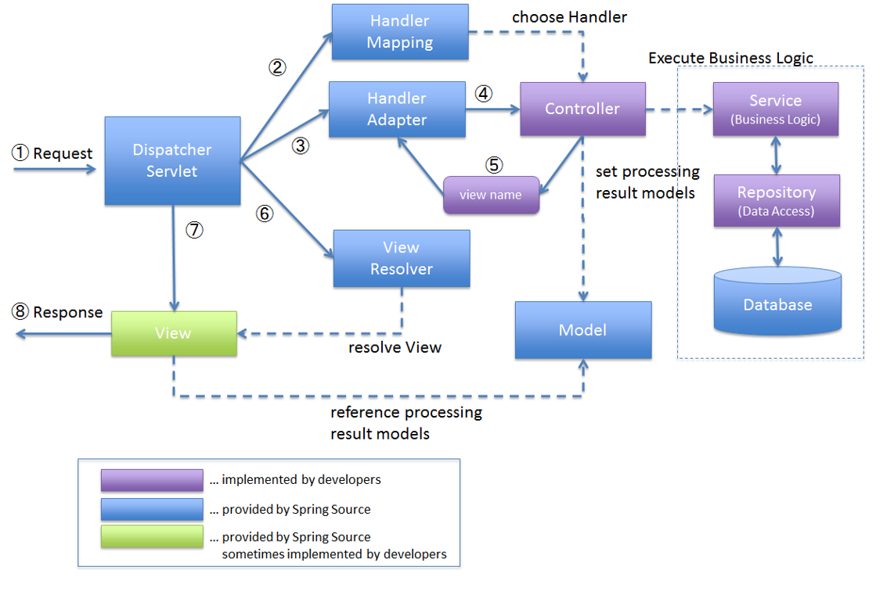
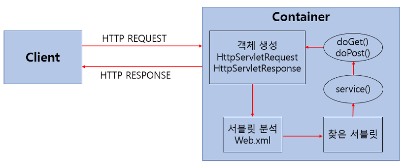

### 스프링 MVC, DispatcherServlet, Servlet

### 스프링 MVC 란?

Model, View, Controller 의 약자다. 각 레이어간 기능을 구분하는 데에 중점을 둔 디자인 패턴. 

 

Model

- 데이터관리, 비즈니스 로직을 처리하는 부분
- e.g. Dao, Dto, Service 

View

- 비즈니스 로직의 처리 결과를 통해 UI가 표현되는 계층
- e.g. html, jsp, thymeleaf, mustache, json (REST API 응답)

Controller

- 사용자의 요청을 처리, Model,View를 중개하는 역할을 수행
- Model, View는 서로 연결되어 있지 않기에 Controller 가 중간에서 통신 매체가 되어준다.

 

### Client → DispatcherServlet → HandlerMapping → Controller → DispatcherServlet → ViewResolver/View 까지의 처리 과정

간단하게 설명해보면 이렇다. DispatcherServlet 이 핵심적인 역할을 담당한다.

- Client → DispatcherServlet ↔ Controller
  - 클라이언트에서의 URL 요청은 DispatcherServlet 이 HandlerMapping을 조회해서 어느 컨트롤러에 대한 요청인지 검색한다.
  - 그리고 그 결과에 따라 해당되는 Controller 를 찾는다.  Controller 는 View 의 이름을 DispatcherServlet 에게 return 한다.
- DispatcherServlet ↔ (ViewResolver → View)
  - DispatcherServlet 은 ViewResolver에서 View 의 이름을 기반으로 일치하는 View 가 있는지 조회한다.
  - View를 찾았다면 조회 결과에 맞는 View 를 DispatcherServlet 에 리턴한다.
- DispatcherServlet → Client
  - DispatcherServlet 은 전달받은 View 객체를 통해 Client 에게 View 를 리턴한다.

 

### Spring MVC가 DispatcherServlet 을 통해 요청을 처리하는 자세한 과정

 

1 ) 클라이언트는 URL 을 통해 요청을 전송한다.

2 ) **DispatcherServlet** 은 **Handler Mapping** (@RequestMapping, @GetMapping, ... etc) 을 통해 해당 요청이 어느 컨트롤러에게로 온 요청인지 찾는다.

3 ) **DispatcherServlet** 은 **Handler Adapter** 에게 요청의 전달을 맡긴다.

- 요청의 전달은 Handler Adapter가 수행

4 ) **Handler Adapter** 는 해당되는 Controller 에 요청을 전달한다.

- 요청의 전달은 Handler Adapter가 수행

5 ) Controller 는 비즈니스 로직을 처리한 후에 **반환할 뷰의 이름 (view name)을 반환**한다.

- JSP , thymeleaf 등등

6 ) Dispatcher Servlet 은  View Resolver 를 통해 반환할 뷰를 찾는다.

7 ) Dispatcher Servlet 은 Controller 에서 View 에 전달할 데이터를 추가한다.

8 ) 데이터가 추가된 View (thymeleaf html, jsp, 등등) 를 반환한다.

 

DispatcherServlet

- 클라이언트에게 요청을 받아 응답까지의 MVC 처리 과정을 통제
- HandlerMapping ( @RequestMapping, @GetMapping 등)을 찾아서 요청이 어떤 컨트롤러로 온 요청인지 찾는다.
- Handler Adapter 를 사용해 요청을 Controller 에게 전달한다.
- View Resolver 를 사용해서 반환할 뷰를 찾는다.
- Controller 에서 View 에 전달할 데이터를 추가한다.

HandlerMapping

- 클라이언트의 요청 URL을 어떤 Controller 가 처리할지 결정한다.
- e.g. 
  - @RequestMapping, @GetMapping 등의 어노테이션이 적용된 메서드/클래스를 리플렉션을 사용해 뒤져서 어떤 컨트롤러로 온 요청인지 찾는다.

HandlerAdapter

- HandlerMapping 을 통해 찾아낸 핸들러 정보를 통해 해당 컨트롤러의 해당 메서드를 직접 호출해주는 역할을 한다.
- 요청을 전달해준다(Adapter)

ViewResolver

- Controller 의 처리 결과(데이터)를 생성할 view 를 결정하는 역할을 수행한다.
- DispatcherServlet 은 View Resolver를 통해 반환할 뷰를 찾는다.

 

### @RequestBody, @RequestParam, @ModelAttribute

@RequestBody

- 클라이언트가 전송하는 JSON 형태의 요청 파라미터를 MessageConverter를 이용해 Java Object로 변환시켜주는 역할을 한다.
- 값을 주입하지 않고 값을 변환시킨다.(Reflection 사용)
- 생성자, Getter, Setter 가 없어도 정상적으로 값을 할당한다.

 

@RequestParam

- 파라미터 하나를 받을 때 사용
- @RequestParam 은 필수 여부가 true 다.
- 기본적으로 반드시 해당 파라미터가 전송되어야 한다. 만약 전송되지 않으면 400 Error 를 유발된다.
- <u>반드시 필요한 값이 아니라면 required 를 false 로 설정</u>해줘야 한다.

 

@ModelAttribute

- Http 파라미터를 생성자, Getter, Setter 를 통해 주입한다.
- 값을 변환해서 주입하는 것이 아니라 값을 주입시키는 것이기에 생성자,Getter,Setter 가 없으면 변수들이 저장되지 않는다.

 

### 서블릿이란?

- 자바에서 제공하는 HTTP 요청/응답을 처리하기 위한 자바 웹 프로그래밍 기술
- Spring MVC 에서는 Controller 계층에서 서블릿 기술들이 사용된다.

 

### 서블릿의 동작 방식

 

- 사용자가 브라우저에 URL을 입력해서 HTTP Request 가 발생한다. HTTP Request 는 Servlet Container로 전송된다.
- 요청을 받은 Servlet Container 는 HttpServletRequest, HttpServletResponse 객체를 생성한다.
- web.xml 을 기반으로 사용자가 요청한 URL이 어느 서블릿에 대한 요청인지 찾는다.
- 해당 서블릿에서 Service 메서드를 호출하고 GET,POST 여부에 따라 doGet(), doPost()를 호출한다.
- doGet(), doPost() 메서드는 동적 페이지를 생성해서 HttpServletResponse 에 응답을 보낸다.
- 응답이 끝나면 HttpServletRequest, HttpServletResponse 객체를 소멸시킨다.

 

