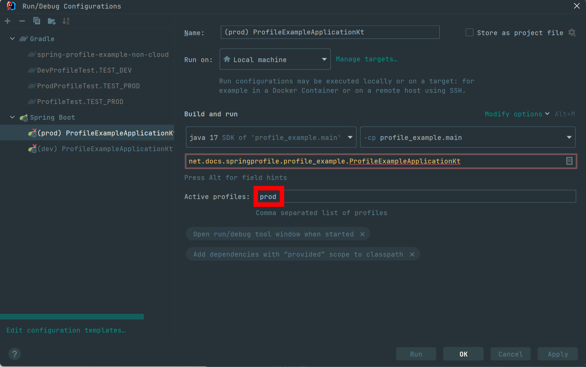
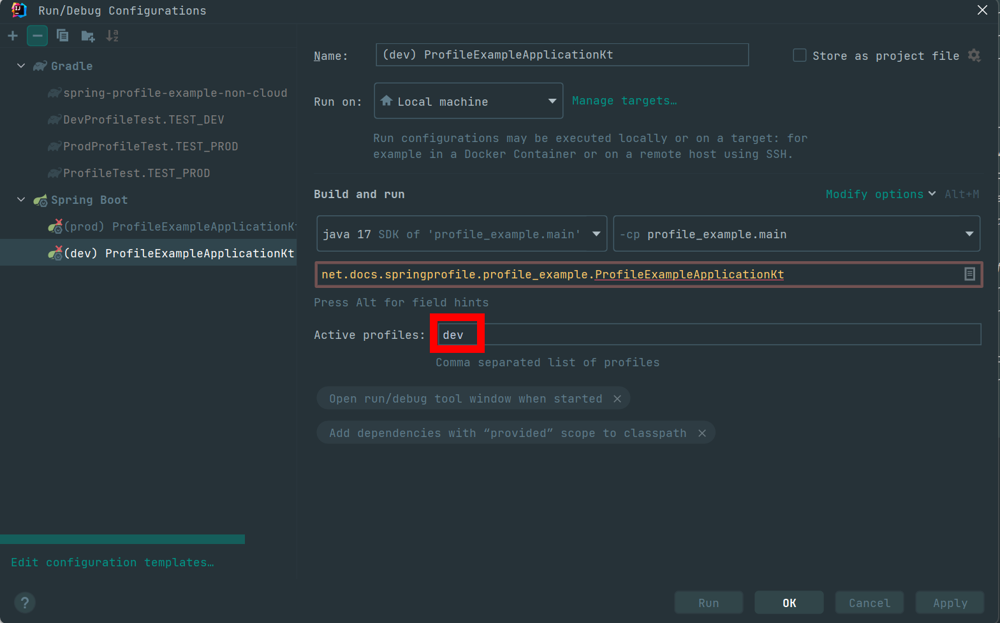

### Spring Profile 에 여러가지 yml 파일을 그룹화해서 유연하게 사용하기

이번 문서는 Spring Cloud 쪽의 Profile 이야기는 아니다. <br>

2.4.x 이후로 변경된 Spring Profile 에 yml 파일을 그룹화하거나 일부 속성을 공통화해서 재사용하는 방식에 대한 이야기다. <br>

yml 파일을 잘 구성해서 공통부분 분리 잘하고 유연하게 변경 가능하게 yml 을 만들줄 알면 spring cloud config 서버가 참조할 yml 속성 구조 작성시에 도움이 꽤 된다. 아마도 이걸 모르면 yml 파일을 수없이 만들고 수없이 수정하고 수없이 실수하고를 반복하지 않을까 싶기도..ㅋㅋ<br>

<br>


### 작동환경

- Spring Boot 2.4.x 이후 버전

> Spring Framework 도 동일하게 동작할 것으로 보임. Plain 한 Spring Framework 를 다뤄본 적이 4년전이라 이제는 쌩 Spring Framework 는 거의 기억이 안난다는...

<br>


### 참고자료

- [Spring Boot 2.4 변경 내용](tangoblog.tistory.com/13)
  - 이 자료 마음에 든다!!! 흐흐흐
- [Spring Boot 외부에서 설정 주입하기](https://www.latera.kr/reference/java/2019-09-29-spring-boot-config-externalize/)

<br>


### 다중 yaml 활성화 순서

`---` 로 여러개의 profile 들을 늘여서 적는 방식을 multi document YAML 이라고 부른다.

2.4 버전부터는 상단에 선언된 document 가 먼저 추가되고, 덮어쓰는 속성이 있으면 나중에 추가되는 document 가 속성을 덮어쓴다.

<br>


### group

spring.profiles.include 는 spring.profiles.group 으로 변경되었다.

예전 방식

```yaml
spring.application.name: order-service
---
spring.profiles: prod
spring.profiles.include: user-database-prod, user-token-prod

... (중략) ...

```

<br>


2.4 이후

```yaml
spring:
  application:
    name: order-service
  profiles:
    group:
      prod: user-database-prod, user-token-prod
      dev: user-database-dev, user-token-dev
---
spring:
  config:
    activate:
      on-profile: user-database-prod
  datasource:
    driver-class-name: org.h2.Driver
    url: jdbc:h2:mem:proddb
    username: sa
    password:
---
spring:
  config:
    activate:
      on-profile: user-database-dev
  datasource:
    driver-class-name: org.h2.Driver
    url: jdbc:h2:mem:devdb
    username: sa
    password:
---
spring:
  config:
    activate:
      on-profile: user-token-prod
token:
  expiration_time: 864000000
  secret: user_token_prod
---
spring:
  config:
    activate:
      on-profile: user-token-dev
token:
  expiration_time: 864000000
  secret: user_token_dev
```

<br>


### 테스트

일단 여기까지 작성해봤으니 테스트를 해보자.

ProdProfileTest.kt

```kotlin
package net.docs.springprofile.profile_example

import org.assertj.core.api.Assertions.assertThat
import org.junit.jupiter.api.Test
import org.springframework.beans.factory.annotation.Autowired
import org.springframework.boot.test.context.SpringBootTest
import org.springframework.core.env.Environment
import org.springframework.test.context.ActiveProfiles

@ActiveProfiles("prod")
@SpringBootTest
class ProdProfileTest {

    @Autowired
    private lateinit var environment: Environment

    @Test
    fun TEST_PROD(){
        val url = environment.getProperty("spring.datasource.url")
        assertThat(url).isEqualTo("jdbc:h2:mem:proddb")

        val tokenSecret = environment.getProperty("token.secret")
        assertThat(tokenSecret).isEqualTo("user_token_prod")
    }

}
```

<br>


DevProfileTest.kt

```kotlin
package net.docs.springprofile.profile_example

import org.assertj.core.api.Assertions
import org.junit.jupiter.api.Test
import org.springframework.beans.factory.annotation.Autowired
import org.springframework.boot.test.context.SpringBootTest
import org.springframework.core.env.Environment
import org.springframework.test.context.ActiveProfiles

@ActiveProfiles("dev")
@SpringBootTest
class DevProfileTest {

    @Autowired
    private lateinit var environment: Environment

    @Test
    fun TEST_DEV(){
        val url = environment.getProperty("spring.datasource.url")
        Assertions.assertThat(url).isEqualTo("jdbc:h2:mem:devdb")

        val tokenSecret = environment.getProperty("token.secret")
        Assertions.assertThat(tokenSecret).isEqualTo("user_token_dev")
    }

}
```

<br>


### WAS 기동시켜서 확인해보기

아래 코드를 작성하자.

**PrintEnvCommandLineRunner.kt**

```kotlin
package net.docs.springprofile.profile_example

import org.slf4j.LoggerFactory
import org.springframework.boot.CommandLineRunner
import org.springframework.context.annotation.Configuration
import org.springframework.core.env.Environment

@Configuration
class PrintEnvCommandLineRunner (
    val environment: Environment
): CommandLineRunner{
    private val logger = LoggerFactory.getLogger(javaClass)
    override fun run(vararg args: String?) {
        val url = environment.getProperty("spring.datasource.url")
        logger.info(">>>>>>> url = ${url}")

        val tokenSecret = environment.getProperty("token.secret")
        logger.info(">>>>>>> token.secret = ${tokenSecret}")
    }

}
```


#### Prod 프로필에서 실행

터미널에 아래 명령어를 수행

```bash
java -jar build/libs/profile_example-0.0.1-SNAPSHOT.jar --spring.profiles.active=prod
```

<br>


Run Configurations 에서 prod 설정 후 실행



<br>


#### dev 프로필에서 실행

터미널에 아래 명령어를 수행

```bash
java -jar build/libs/profile_example-0.0.1-SNAPSHOT.jar --spring.profiles.active=dev
```

<br>


Run Configurations 에서 dev 설정 후 실행



<br>


