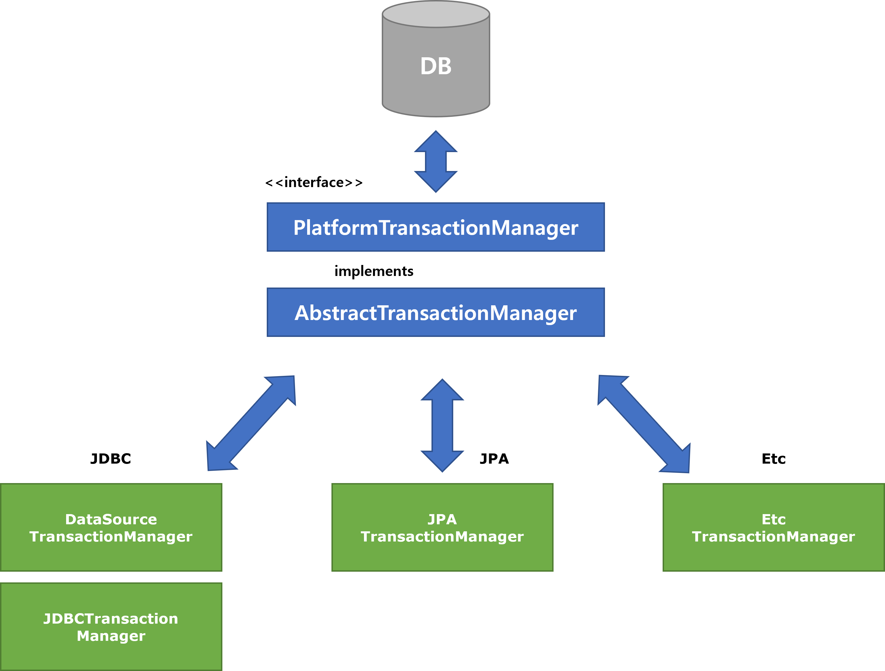

# TransactionManager 추상화 - PlatformTransacitonManager

spring-data 에서 지원하는 TransactionManager는 여러가지 종류가 있다.

- `DataSourceTransctionManager` 
- `JdbcTransactionManager`
- `JpaTransactionManager` 
- `EtcTrasactionManager`

이렇게 다양한 종류의 TransactionManager 들은 Spring Data 에서 규격화한 표준 인터페이스인 PlatformTransactionManager 를 따른다.

<br>



<BR>


인터페이스 `PlatformTransactionManager` 의 코드는 아래와 같다.
**PlatformTransactionManager.java**

```java
public interface PlatformTransactionManager extends TransactionManager {
    TransactionStatus getTransaction(@Nullable TransactionDefinition definition)
			throws TransactionException;
    void commit(TransactionStatus status) throws TransactionException;
    void rollback(TransactionStatus status) throws TransactionException;
}
```

PlatformTransactionManager 인터페이스는 getTransaction(), commit(), rollback() 를 명시하고 있다.<BR>

<BR>


즉, `DataSourceTransactionManager`, `JdbcTransactionManager`, `JpaTransactionManager`, `EtcTransactionManager` 는 모두 PlatformTransactionManager 의 getTransaction(), commit(), rollback() 이라는 기능을 필수적으로 오버라이딩(구현)하고 있으며, 세부적인 동작은 개별적으로 각각 다르게 동작한다.<BR>


예를 들면 JPATransactionManager 객체를 생성할 경우 아래와 같이 스프링 컨테이너에 빈으로 등록할 때 구체타입인 `JpaTrasactionManager` 타입이 아닌 `PlatformTrasactionManager` 타입으로 빈으로 등록해서 사용한다. (참고 : [Spring Data JPA - Reference Documentation](https://docs.spring.io/spring-data/jpa/docs/current/reference/html/#jpa.java-config) )

```java
@Configuration
@EnableJpaRepositories
@EnableTransactionManagement
class ApplicationConfig {

  @Bean
  public DataSource dataSource() {

    EmbeddedDatabaseBuilder builder = new EmbeddedDatabaseBuilder();
    return builder.setType(EmbeddedDatabaseType.HSQL).build();
  }

  @Bean
  public LocalContainerEntityManagerFactoryBean entityManagerFactory() {

    HibernateJpaVendorAdapter vendorAdapter = new HibernateJpaVendorAdapter();
    vendorAdapter.setGenerateDdl(true);

    LocalContainerEntityManagerFactoryBean factory = new LocalContainerEntityManagerFactoryBean();
    factory.setJpaVendorAdapter(vendorAdapter);
    factory.setPackagesToScan("com.acme.domain");
    factory.setDataSource(dataSource());
    return factory;
  }

  @Bean
  public PlatformTransactionManager transactionManager(EntityManagerFactory entityManagerFactory) {

    JpaTransactionManager txManager = new JpaTransactionManager();
    txManager.setEntityManagerFactory(entityManagerFactory);
    return txManager;
  }
}
```

이 외에도 JDBCTemplate, Mybatis 와 같은 JDBC 라이브러리에 대한 트랜잭션 매니저 인스턴스 객체도 위와 같은 방식으로 PlatformTransactionManager 타입으로 스프링 컨테이너에 등록해두면 된다.<BR>


JdbcTemplate, JPA, Etc(Mybatis, etc ...) 에 대한 TransactionManager 들에 대한 레퍼런스 문서들은 아래와 같다.

- JDBCTemplate : DataSourceTransactionManager, JdbcTransactionManager
  - [DataSourceTransactionManager (Spring Framework 5.3.20 API)](https://docs.spring.io/spring-framework/docs/current/javadoc-api/org/springframework/jdbc/datasource/DataSourceTransactionManager.html)
  - [JdbcTransactionManager (Spring Framework 5.3.20 API)](https://docs.spring.io/spring-framework/docs/current/javadoc-api/org/springframework/jdbc/support/JdbcTransactionManager.html) 
- JPA : JpaTransactionManager
  - [JpaTransactionManager (Spring Framework 5.3.20 API)](https://docs.spring.io/spring-framework/docs/current/javadoc-api/org/springframework/orm/jpa/JpaTransactionManager.html)
- Etc : EtcTransactionManager

<br>

